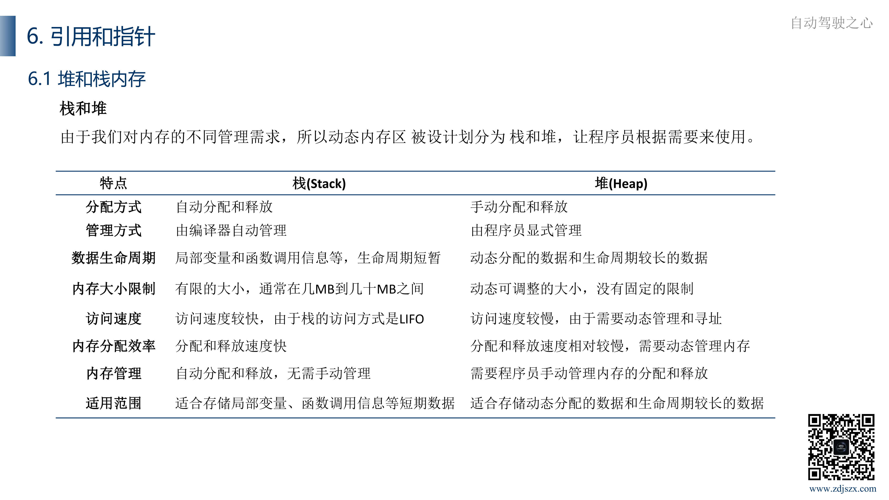
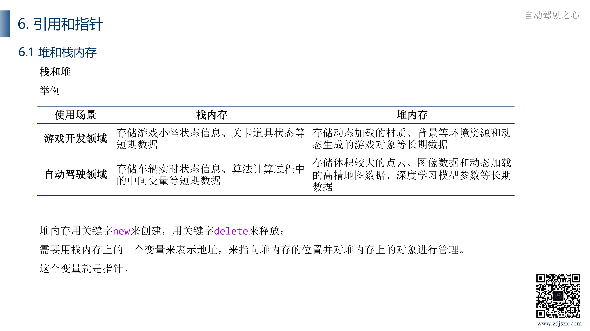

# 前言与环境配置

## 编程语言异同

**编译语言**、**虚拟机语言**和**解释型语言**是编程语言的三种不同类型，它们在代码执行的方式上有所不同。

1. 编译语言（Compiled Language）
   - 例子：C、C++ 等。
   - 编译过程：编译语言的源代码在运行之前需要通过编译器转换为机器码或字节码，编译器会一次性将整个源代码转换为目标代码。
   - 执行方式：编译生成的目标代码可以直接在计算机上运行，而无需再次进行翻译。这通常意味着编译语言的执行速度相对较快。

2. 虚拟机语言（Bytecode Language）
   - 例子：Java、C#（通过Java虚拟机和.NET虚拟机执行）。
   - 编译过程：虚拟机语言的源代码会先被编译成中间代码（字节码），而不是直接编译为机器码。
   - 执行方式：中间代码在运行时由虚拟机解释执行，或者被即时编译为目标机器码执行。这种方式结合了编译语言和解释型语言的特点。

3. 解释型语言（Interpreted Language）
   - 例子：Python、JavaScript等。
   - 执行方式：解释型语言的源代码是逐行或逐语句被解释器执行的，而不需要通过编译步骤生成目标代码。解释器在运行时直接对源代码进行解释执行。
   - 优点： 灵活性较高，代码可以在不同平台上直接运行，无需事先编译。
   - 缺点：执行速度通常较慢，因为每次运行都需要解释代码。

语言特点分析

1. Python是一种解释型语言，这意味着Python代码不需要预先编译，而是可以逐行解释执行。这种解释性质使得Python更灵活，但也导致了性能上的较大牺牲。
2. C是一种过程式语言，主要关注过程和函数。通常用于嵌入式系统、操作系统、系统级编程等对性能要求较高的领域。
3. Java是一种先被编译成字节码、然后在Java虚拟机上运行的编程语言，并可以自动进行GC（垃圾回收）。这使得Java具有跨平台的特性，但也引入了一些性能开销。Java是一种跨平台的面向对象语言，适用于大型企业级应用。
4. C#是一种面向对象的语言，适合构建Windows应用和Web应用。C#最初是为Windows平台设计的，因此在其他平台上的支持相对较弱，生态较弱。
5. JavaScript和PHP通常用于Web开发、互联网应用，在Web领域有很强大的生态，除此之外却用处不多。都是弱类型语言，可能导致一些类型相关的错误，难以调试和理解。
6. Matlab：MATLAB脚本语言在数学建模、科学计算和工程应用方面具有强大的功能，但这都基于MATLAB软件生态或者说后面公司的支持。在一些方面，如开源性、通用性和性能方面，则存在很大限制

# 基础

`main` 函数可以有参数，比如说

```cpp
int main(int argc,char *argv[])
```

也就是参数的数量和值

`cin` 输入的时候，可以使用空格隔开不同位置的输入，比如说

```cpp
cin >> age >> name;
```

如果输入的是 “10 Li Hua”，那么只有 `Li` 会被赋值给 `name` 变量

命名空间是一个相对高级的特性，好处有如下

1. 避免命名冲突：在大型项目中，往往会有多个开发者编写代码，如果不使用命名空间，不同模块或者不同开发者编写的代码可能会出现相同的名称，导致命名冲突。使用命名空间可以将代码组织成独立的命名空间，从而避免这种冲突。
2. 代码组织和结构化：命名空间可以帮助我们更好地组织代码，将相关功能或者类分组在一起，提高代码的可读 性和可维护性。通过命名空间，可以清晰地知道某个功能或者类属于哪个模块或者库。
3. 模块化开发：命名空间促进了模块化开发，使得不同的功能模块可以独立开发、测试和维护。这种模块化的开 发方式有助于降低代码耦合度，提高代码的复用性和可维护性。
4. 标准化和规范化：通过命名空间，可以为不同的功能或者模块定义一套命名规范，使得整个项目的代码风格更 加统一和规范化。这有助于提高团队协作效率，并且降低后续开发和维护的难度。 

所以，C++标准委员会引入了命名空间这一特性。它类似于一个容器，是用来组织程序中的代码、并防止 命名冲突的一种有效机制。

命名空间的定义使用关键字 `namespace`，后跟命名空间的名称，如下所示：

``` cpp
namespace namespace_name { /* code */ }
```

为了调用带有命名空间的函数或变量，需要在前面加上命名空间的名称，如下所示： 

```cpp
namespace_name::code; // code 可以是变量或函数
```


```cpp
#include<iostream>
using namespace std;
namespace perception { // 第一个命名空间
	void Infer(){cout << “Perception infer." << endl; }
}
namespace prediction { // 第二个命名空间
	void Infer(){cout << “Prediction infer." << endl; }
}
int main () {
    // 调用第一个命名空间中的推理函数
    perception::Infer();
    // 调用第二个命名空间中的推理函数
    prediction::Infer();
    return 0;
}
```

命名空间可以嵌套，形成层级结构，以便更好地组织代码。

但是，如果需要大量调用、多次调用某个命名空间下面的实体，可以用 `using` 来简化调用方式。 `using` 可以指定特定的命名空间，也可以只指定命名空间中的特定实体。

浮点数因为其浮动的特性，所以想判断浮点数与一个数是否相等，可以使用绝对值求差，然后看差值是否小于一个很小的数

## 枚举

如果一个变量只有几种可能的值，可以定义为枚举（enumeration**）**类型。 所谓“枚举”是指将变量的值一一列举出来，变量的值只能在列举出来的值的范围内。 枚举类型为了让程序员使用有意义的符号名称来表示特定的值，而不是使用无意义的数字。

```cpp
enum LidarStatus{
    running,
    stop,
    stopping
};
```

上面就声明了枚举类型，`LidarStatus` 是枚举名，`running` 等是枚举值或者说枚举成员

也可以制定枚举类型的底层类型，如指定为 32 位整数，注意一下，枚举类型的变量只能指定为整数

```cpp
enum LidarStatus : int32_t{
    LidarStatus,
    stop,
    stopping
};
```

使用的时候需要注意一下，由于强类型枚举（enum class）不会隐式转换为整数类型，因此必须使用显式类型转换来将枚举成员转 换为整数类型。

```cpp
LidarStatus value = LidarStatus::LidarStatus;
int intValue = static_cast<int>(value);
```

## 字符串


## 函数

定义和声明一般分开写，只有一些临时使用的函数才直接书写

高级编程语言中，C/C++这样的系统编程语言，广泛采用了源文件、头文件的代码组织方式，因此最常见的文件类型是：

- 头文件（header file，简写为hdr），在C++中以.h或.hpp结尾，一般包含函数、类等的声明，用于在不同的源文件中共享接口
- 源文件（source file，简写为src），在C++中以.cpp或.cc结尾，一般包含函数、类等的定义，用于复用实现
- 库文件（library file，简写为lib）：预编译的源文件和头文件，封装了可重用的代码。分为静态库（.a文件）和动态库（.so文件）。

库文件是已经完成了编译的文件，优点如下

1. 加速编译：库包含其他模块编译需要的中间目标代码，可以避免多次编译，加快编译速度。
2. 统一版本控制：库方便统一管理文件版本，使用者只需要关心库的版本即可，不用担心不同文件版本不兼容的问题。
3. 提供知识产权保护：开发者可以只发布库的二进制版本，无需暴露源代码，保护知识产权。

## 指针

每一个变量都有一个内存位置，内存地址表示这个位置，用 `&` 符号可以获取变量地址。如果地址进行加减，结果也是一个地址





定义：指针（pointer）是一种特殊的变量，其值为内存地址，可以通过指针可以直接访问和操作内存中的数据。

基本使用方法

- 声明语法：`Type \*pointer_name;`，其中 `Type` 是指针所指向的数据类型，`pointer_pame` 是指针变量名。
- 初始化：可以将指针初始化为某个变量的地址，也可以将其初始化为 `nullptr`（空指针）。
- 取地址操作符：`&`，用于获取变量的地址。
- 解引用操作符：`*`，用于访问指针所指向的数据。
- 长度：不管 `Type` 是什么，指针长度都是一样，都是一个代表内存地址的长的十六进制数。

在函数中，一般是使用引用的，引用的好处就是可以使用但是无法更改所引用变量的内容

# OOP编程

如果不加权限控制符号，那么就默认是私有的

构造函数（Constructor method），为对象本身分配内存空间，进行初始化。

- 构造函数是一种特殊的成员函数，与类同名。

- 构造函数在创建对象时被自动调用，不能主动调用。

- 构造函数没有返回值，但可以有参数，可以重载。

- 如果没有显式定义构造函数，编译器会提供一个默认的无参构造函数，也可以直接使用默认定义

  ```cpp
  class demo{
      demo() = default;
  }
  ```

- 构造函数可以在public、protected、private区域定义，影响其访问性。

析构函数(Destructor method)，为对象本身做销毁，并释放内存空间。

- 析构函数也是一种特殊的成员函数，函数名是~加类名。
- 析构函数在对象被销毁时自动被调用，不能主动调用。
- 析构函数没有参数和返回值，不能重载。
- 如果没有显式定义析构函数，编译器会提供一个默认的析构函数。
- 析构函数可以在public、protected、private区域定义，影响其访问性。
- 析构函数常用于释放对象占用的资源，也可以输出一些信息

不过，因为析构函数和构造函数是自动执行的，没有返回值，所以可以把一些复杂的初始化和销毁的代码单独放在一个初始化或者销毁函数中，并且返回布尔类型变量来判断是否成功

## 赋值函数

赋值函数又称赋值操作符重载函数，用于将一个已经存在的对象的值赋给另一个已经存在的对象，编译器有默认的赋值函数，会逐个成员地执行赋值操作，如果显式地定义赋值函数，那么就会执行自定义的赋值函数

定义赋值函数的话，操作如下

```cpp
class Node{
public:
    Node& operator=(const Node& other){
        return *this;
    }
}
```

是一个名为 `operator=` 的特殊成员函数，参数是对同类型对象的引用，返回值是对自身的引用（`*this`）

显式定义赋值函数可以解决默认赋值函数的浅拷贝问题。

赋值的时候要注意一下，不要自己给自己赋值，判断操作如下

```cpp
class Node{
public:
    double value;
    Node& operator=(const Node& other){
        if (&other != this){
            value = other.value;
        }
        return *this;
    }
}
```

## 指针

this是一个C++关键字，表示指向当前对象的指针。此关键字主要是用与类内，区分类成员变量和同名局部变量的，通过this指针，成员函数可以访问、调用对象的成员变量和成员方法。

使用方法如下

```cpp
class Node{
public:
    int Value;
    int get_value(){
        return this->Value;
    }
}
```


- 每个非静态成员函数都有一个隐式的this指针参数，指向调用该函数的对象。理解this指针，可以帮助我们理解类成员函数的实际调用过程。
- this指针的类型是class类型的常量指针，即 `ClassName* const`，这表明this指针的指向不能被改变
- 返回当前对象的引用，例如在赋值操作符重载函数中返回 `*this`

## 静态类型

静态可以理解为静止的变量，也就是在程序运行期间一直存在，静态变量只会被初始化一次，在第一次进入函数时进行初始化，在程序退出的时候才会销毁

常用的静态类型有静态成员变量和静态成员函数，静态成员属于类本身，而不是某一个特定的类对象，静态成员变量在类的所有实例之间共享，并且只有一个副本，就比如说所有的中国人都有中国国籍

使用方法可以直接根据类名和函数名去访问，所以静态方法经常性用于一些工具属性的对象或者函数中

## 封装、继承、多态

在面向对象编程中，封装是指将数据和操作数据的方法包裹在一个类中，并尽可能地隐藏类的内部细节，只暴露必要的接口给外部使用。封装有助于确保数据的完整性，防止外部代码对内部数据的非法访问和修改。

这种权限控制通过访问修饰符来提供

- `public` 成员可以被类内部和外部的代码访问，它们构成了类的外部接口。
- `protected` 成员可以被类内部和派生类的代码访问，但不能被外部代码直接访问。
- `private` 成员只能被类内部的代码访问，派生类和外部代码都不能直接访问。