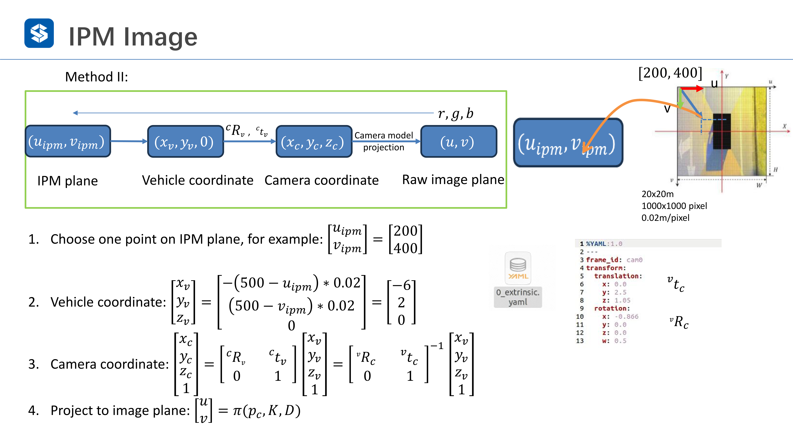

# IPM

逆投影变换 IPM 实际上就是把相机观测到的图像逆映射回去，当然因为维度的缺失所以很难得到很好的结果，一般来说 IPM 假设周围环境是一个平面（或者说只有地面），当然这在实际工作中是不可能的，地面上总有不平或者各种物体，所以 IPM 目前并不是一个很好的方法

实际上 IPM 有两种方法，一种是基于正向投影的方法，一种是基于鸟瞰图的方法

基于正向投影的方法是从前视图出发，转换到车身坐标系，然后直接投影到 BEV 平面，但是这种方法会涉及一个未知的深度，所以难以操作

如果使用 BEV 方法，从 BEV 上的像素点出发，往图像上投影，看会落在哪里，然后查看此位置的像素值来填充鸟瞰图，这样操作就方便很多

具体操作如下图所示

假设 IPM 图的分辨率是 1000 X 1000，那么在 (200,400) 处的像素点，其对应于前视图中的某一个像素点，那么就可以把对应像素点的像素值填充到 IPM 此处的像素上

第一步操作就是把 IPM 上一个像素的点转换到车身坐标系下，比如说 IPM 的比例是一个像素表示 0.02 米的话，那么 (200,400) 处的点对应车身坐标系下的 (-6,2,0) 处，然后基于投影变换矩阵计算出来其在相机坐标系下的点以及对应在前视图上的点