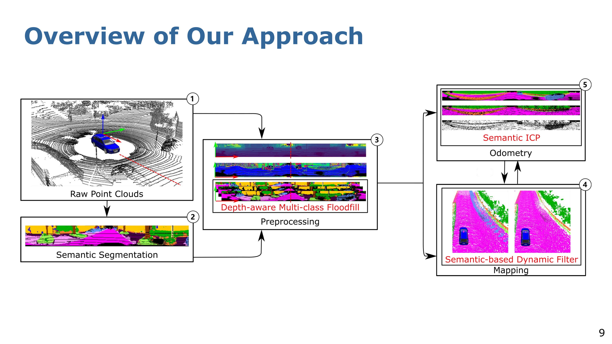
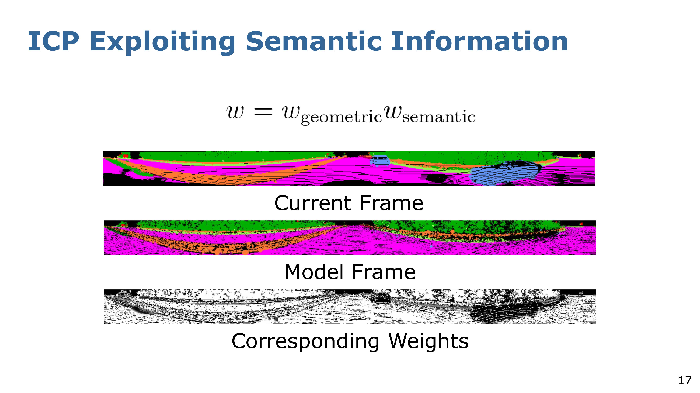
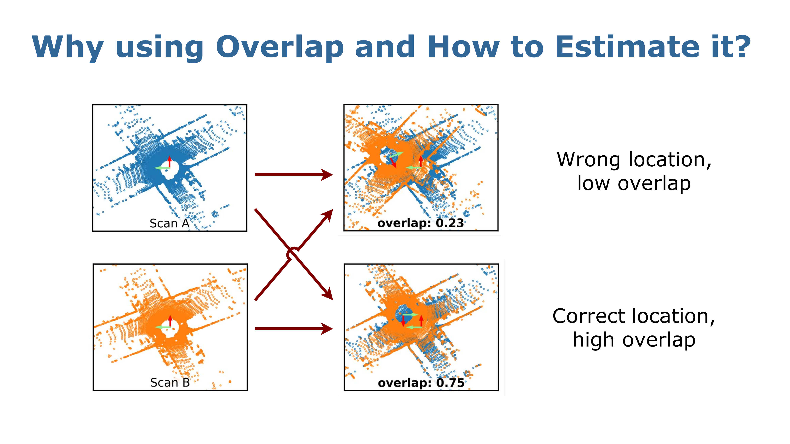
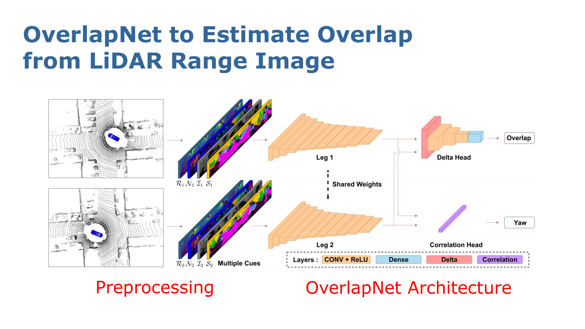
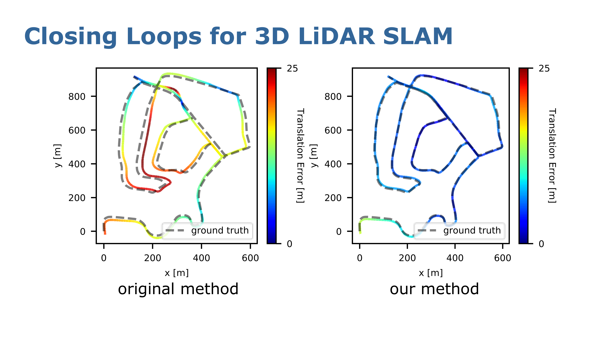

# 语义SLAM

## SuMa++

传统的激光SLAM是基于几何信息的，但是在某些动态场景下这种SLAM框架会出现严重错误，比如说在道路上行驶的车辆，周围会存在其他的运动车辆，当车辆本身与其他车辆一起运动的时候，会导致点云严重畸变，甚至可能车辆之间相对静止，导致位姿估计严重错误，如果使用语义信息来剔除这些点，那么就可以更好的进行定位和建图

实际上激光语义SLAM的整体框架如下，当输入为纯点云的时候，我们先对点云进行语义分割和转换（这里主要是转换为Range Image这种形式），然后与原始点云一起进行处理，得到预处理后的点云进行建图和定位这些

首先将原始点云投影为一个 Range Image（大概如下图所示），利用点云不断扫描的特性，将其投影到一个圆柱形上，然后将圆柱表面展开为一个深度图（每个像素就是点云测量的距离），这样子就可以把图像处理和深度学习的一些方法应用，这种操作还有降维作用，并且可以使用GPU加速处理

然后在语义分割部分就直接基于RangeImage进行，这部分可以使用RangeNet工具进行处理，然后进行重投影得到带有语义的点云，便于下一步的预处理，比如说利用深度信息对语义分割中的噪点进行剔除，这种方法很简单，基于语义信息对带有语义的RangeImage进行腐蚀+膨胀操作，然后就可以得到干净的语义点云

然后就可以进行建图和定位了，其中建图部分可以剔除动态物体中的点云，这里需要介绍一下面元地图

面元（surfel）的核心思想就是使用一个圆盘状小面片来近似表示局部曲面，比如说输入点云中有一组相邻点的法向量信息一致，那么就可以使用一个面元来表示，这样子可以降低存储点的数量和提供更有用的信息

那么有了面元地图之后如何剔除动态物体呢？一个很简单的思想就是删除掉所有的潜在移动物体，比如说车辆、行人这些，这些物体很有可能是移动的，剔除的话会对长期定位有帮助，但是这样子存在一个问题，当某些物体处于静止不动的情况时，可能会对定位有更大帮助（比如说街道上静止不动的车辆），所以需要设计一个新的算法，可以剔除真正移动的物体并且保留静止不动的物体

所以有一种方法就是面元稳定性，其公式如下所示，可以在时间维度上对面元的稳定性进行更新，这里涉及到语义信息的一致性，也就是指同一个静止物体在不同的观测中，它的语义标签应该是一致的。那么，对于移动物体而言，因为这个目标物体是移动的，所以我的每一次观测真正的移动物体都会发现其在不同的位置，因此同一个位置对应的语义信息就会发生变化，因此可以在观测到语义标签变化的时候更新稳定性，如果一个面元的稳定性低于阈值时就可以进行剔除，而静止物体的面元稳定性会相对较高从而得到保留，因此可以有效区分动态和静态的物体，从而得到干净的地图

同时，语义信息为ICP方法提供了一个很好的帮助，可以同时基于几何信息和语义信息进行ICP计算，比如说基于RangeImage对比两帧图像，与光流法一样查看图像中的所有噪点，然后降低噪点对应的权重，以此来降低噪点带来的影响从而实现更高精度的匹配

## OverlapNet

核心思想就是使用语言信息来辅助SLAM进行回环，降低漂移和提高精度，具体方法为利用端到端的深度学习方式来估计两帧激光雷达点云之间的重叠部分大小和相对偏航角，然后基于相对位姿估计来改善回环。

Overlap的定义就是，在所有的点云观测数据中，重叠点所占的比例，其中重叠点的定义如下：如果一个激光雷达的测量点能够同时被两个激光雷达点云所包含，那么我们就将其记作为一个重叠点。很容易得出，相近位置的两帧激光雷达点云的overlap比较大，反之相距较远的激光雷达点云的overlap就比较小。但是如果想计算overlap就需要知道两帧点云的相对位姿，那么如何在不知道两帧点云的相对位姿的情况下计算overlap呢，因为在长时间运行之后，哪怕回到了之前经过的点，位置也会出现一定漂移，因此需要一个新的方法判断overlap

作者提出的overlapNet就是这样一个框架，可以基于RangeImage来输出重叠程度和旋转的信息，不过这里输入四通道的RangeImage，包括深度信息、反射强度信息和语义信息，这也是使用RangeImage的好处，可以直接基于二维图像的方法处理三维点云

框架的具体内容如下所示，输入两帧点云对应的四通道的图像，然后使用共享骨干网络（也就是leg部分）提取特征，然后特征一起送入两个检测头获取重叠程度和偏航角

实验效果也很好，回环效果相对原始方法提高很多，并且泛化性能也非常好，在KITTI数据集上训练好之后，在其他的类似数据集上也表现很好

## OverlapNet 全局定位