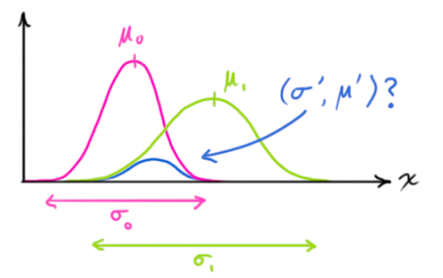

# 概率基础

随机过程是一系列的随机变量，其中的变量相互不独立或者说相互有关系，而且没有办法进行随机试验（这也是最大的难点），一个典型的例子就是股票，股票是无法进行随机试验的，因为你无法时光倒流，并且每一天的股票情况都与前后时间段的股票情况有关

或者说随机过程可以使用一个迭代函数描述，也就是

但是也需要选取一个初值，否则还是无法进行计算，有的情况下可以对初值进行随机试验，但是有的情况下不可以，只能使用主观概率，猜出一个概率出来，这样就给随机过程加入了一定的主观性，所以需要加入外部的观测，如证据、信息等，以此进行修正，从而得到相对客观的概率，或者说得到后验概率

实际上概率的计算有两种方式实现，一种是大数定律，一种是主观先验，二者的区别就在于独立试验能否重复进行，但是大数定律的计算也有一个漏洞，就是两次随机试验是否是真正的独立，所以只能人为的根据经验来认为独立或者是不独立，而且根据独立性公式也有这个漏洞，如果想判断独立性，那么就需要有概率，如果想有概率，那么就需要大数定律或者主观概率进行赋值，所以就成了一个无解套娃，二者相互证明，但是又相互依赖

所以总的来说，从根本上来说，现实世界中的概率计算最终无法逃脱主观性的存在，不过哪怕使用主观概率赋值，也不能随便给出，而且不同的主观概率也会导致不同的结果

先验概率就是先于实验的主观概率，后验概率就是实验之后的概率，可以通过贝叶斯公式来进行转换

似然概率代表的是观测的准确度，比如说温度计有测量误差且与测量温度无关（也就是观测误差），那么当真实温度为  时，实际温度为  的概率有公式

其中似然概率  表示的是真实温度为 10 的情况下，温度计测得温度为 10.3 的概率，这表示了温度计的准确度，对于很多传感器来说，测量误差不受测量值影响，属于传感器本身的固有属性，但是似然概率不能写成概率分布

其中要注意的就是第四个概率，在很多书中认为  这种是一个常数，然后简化公式，实际上这是一个测量事件的概率，但是这带来了第一个疑惑，就是观测结果是固定的，也就是已经发生的，概率理应为 1，但是实际上这是随机变量取值的概率，不是已经发生的事件；第二个疑惑就是如何计算这种概率，实际上是可以通过全概率公式来计算的

还有就是，  与 T 的取值无关，与 T 的分布律有关，因为 T=10 、T=11 代表随机试验的一个结果，结果不会影响分分布律，并且因为概率与分布律有关，所以是常数

似然概率的含义就是哪个原因可能导致这个结果，最大似然估计就是寻找哪个原因最有可能导致这个结果，也就是状态为因，观测为果的话，则有

# 递归算法与数据融合

以测量硬币为例，若干人对同一个硬币进行直径测量，每个人测量的结果都不一定一致，第 k 个人测量结果为 ，然后可以以平均值作为估计值，那么第 k 次测量的估计值为：

然后可以发现

我们可以发现，随着次数的增加，估计值会收敛，测量结果也不那么重要了，但是测量次数少的时候，测量值还是很重要的，如果令 ，则有

也就是当前估计值 = 上一次估计值 + 系数 * （当前测量值 - 上一次估计值），这就是一种递归的思想，也就是当前估计值只与上一次的估计值和当前测量值有关，其中的系数就是卡尔曼增益；而这也是卡尔曼滤波的优势，不需要追溯很久的数据

至于系数的取值，如果当估计误差远大于测量误差的时候，系数趋近于1，那么就更信任测量值而忽视估计值，当测量误差非常大的时候，则系数趋近于0，选择相信估计值，这个时候可以定义估计误差  和测量误差 ，那么增益公式则为

实际上会分为三步，第一步就是基于误差计算卡尔曼增益，第二步就是计算预测值，第三步就是更新估计误差

然后考虑数据融合的情况，假如说有两个称，第一个称的标准差是2克，第二个称的标准差是4g，现在两个称测得的同一个物体的重量分别是30克和32克，那么真实重量是多少呢？我们可以知道，两个称是互不干扰的，也就是两个变量相互独立，设测量值为 z 的话，则有

我们想求出一个使得方差最小的 k 值，那么有

使用求导法，当导数为零的时候就是极值

# 贝叶斯滤波

通过统计的方法，基于贝叶斯公式对随机信号进行处理从而降低其不确定度，或者说处理的是一个随机过程，不过贝叶斯滤波更多的是一种数学概念，而非一种工程上的应用

对于一个随机过程，有一个主观初值 ，有 k 个观测值 ，那么如何根据这些观测值求后验概率呢？第一个方法就是所有的 x 先验概率值都靠猜测，但是这种方法过于依赖观测，放弃了预测信息，也不关注随机过程的递推式，这个方法并不是特别好；第二个方法就是只认为初值的概率是主观先验的，后面的变量的先验概率都是递推的，这个方法可以保留随机过程的特性和变量之间的关系，所以更为完善

可以从状态方程和观测方程开始讲解，其中状态方程是对过程进行建模的，描述了  和  之间的关系，并且可以建立的非常粗糙，如果无法准确描述这个关系甚至看不出来规律，可以使用下面的公式定义：

贝叶斯滤波的奥秘就是融合先验和观测，先验是主观经验，观测是数据信息，如果先验信息为零，那么贝叶斯滤波只能完全依赖观测，所以当写出的表达式越准确，则贝叶斯滤波就可以获得更为准确的信息

那么一个标准的状态方程表达式可以写为：

观测方程是反映状态如何引起传感器读数，其中状态是所要研究的内容或者参数，但是传感器读数并不一定是状态对应的参数，而是其他的与状态有关的数据，比如说测体温时，温度计的观测就是温度，此时观测与状态是一致的；但是当状态是位移、观测是角度的时候的时候，观测与状态并不一致，也就是状态信息进行转化然后加入观测噪声才可以得到观测信息，此时有观测方程公式如下

现在问题就是如何进行递推，当仅有准确的状态方程、没有噪声和观测的情况下，只能给出一个主观先验，但是这种情况下就会导致一旦初值有偏差，后面的结果很容易是完全错误的，所以纯粹的主观先验是不可行的，需要引入观测进行融合

实际上贝叶斯滤波的递推过程分为两步，预测步和更新步，其中预测步就是根据状态方程对下一步状态预测，得到预测的下一步状态，然后引入观测（也就是传感器的测量数据，可以降低方差）对状态先验进行更新得到后验状态，更新步也被称为后验步，然后使用后验之后的概率进行再预测和更新，如此循环

在无观测的情况下，上一步的先验概率作为下一步的先验概率

在有观测的情况下，上一步的后验概率作为下一步的先验概率

在随机过程中有一个重要定理，条件概率里面的条件可以做逻辑推理，条件可以作为已知量进行计算，比如说 

然后贝叶斯滤波的理论推导过程如下，首先有状态方程和观测方程

其中， 、 、 、 都是随机变量，并且我们假设  、 、 是相互独立的，这种假设可以简化计算并且符合我们的主观认识，因为初值、预测噪声和观测噪声（传感器噪声）主观上认为是相互独立的所以假设是相互独立的，同时我们设三者分别有概率密度：

那么预测步有如下步骤，第一步就是计算概率分布，由概率分布的定义有

第二步就是对右侧进行全概率分解，分解为上一步的条件下，这一步状态的概率

第三步就是全概率变形，将条件带入进行计算，然后利用公式 1 中的状态方程进行转化，并且因为  与  相互独立，可以直接化为概率相乘，但是后续的预测噪声与后续的状态是否相互独立呢？这又是另一个问题，也就是需要证明  和  都是相互独立的

然后就可以有分布函数如下

然后对分布函数求导就可以得到预测状态

然后就是更新步，这里观测得到 

完整算法如下：

设置初值：

贝叶斯滤波在理论上是非常完整的，但是在应用上有一个很大的缺陷，就是涉及到无穷积分和解析解，这在实际中是不可能计算的事情，所以才会有了后面的粒子滤波和卡尔曼滤波等方法

所以解决方法有如下几种

1. 做假设：设状态方程和观测方程中的函数都是线性的，并且噪声都服从正态分布，这种方法会推导出后面的卡尔曼滤波；；或者函数是非线性的，则有扩展卡尔曼滤波等
2. 数值积分方法：对无穷积分进行数值积分，比如说高斯积分、蒙特卡洛积分（粒子滤波）和直方图滤波（函数直方图化）

# 卡尔曼滤波

卡尔曼滤波更像是一个观测器，而不是一般意义上的滤波器，其含义可以使用一句话表示：最优化递归数字处理算法

卡尔曼滤波器出现也是为了处理不确定性。，系统不确定性体现有三：不存在完美的数学模型、系统的扰动不可控也很难建模、测量传感器存在误差。

基于状态空间方程，我们有描述系统响应的线性公式如下

w 是过程噪声，u 是控制量，v是测量噪声，而噪声可以认为服从正态分布，也即有下面公式，并且测量噪声认为只与传感器精度有关

如果我们想求现在的状态量，就需要依据上一时刻的状态量和控制量，在不考虑噪声的情况下估计出现在时刻的状态量，这也称为先验估计值（这里有负号上标，与后验估计相对），也就是有下面的公式，其中需要注意的是，上一时刻的状态量也是估计出来的，然后先验估计和测量值都是带有噪声的

我们沿用数据融合部分的理论，我们有下面的公式

然后我们引入误差：

然后我们希望误差的协方差矩阵的迹最小，这样子也就可以让方差最小，同时也认为系统的估计最优

其中针对其中的误差部分进行化简，有

所以原式可以化为

![](https://www.zhihu.com/equation?tex=%0A%5Cbegin%7Balign%7D%0AP_k%20%26%3D%20E%5B%5B%28I%20-K_k%20H%29e%5E-_k-%20K_k%20v_k%5D%5B%28I%20-K_k%20H%29e%5E-_k-%20K_k%20v_k%5D%5ET%5D%5C%5C%0A%26%3D%20E%5B%28I%20-K_k%20H%29e%5E-_k%20e%5E%7B-T%7D_k%28I%20-K_k%20H%29%5ET%5D-E%5B%28I%20-K_k%20H%29e%5E-_k%20K%5ET_k%20v%5ET_k%5D-E%5BK_k%20v_k%20e%5E%7B-T%7D_k%28I%20-K_k%20H%29%5ET%5D%2BE%5BK_k%20v_k%20v%5ET_k%20K%5ET_k%5D%5C%5C%0A%26%3D%20%28I%20-K_k%20H%29%20E%5Be%5E-_k%20e%5E%7B-T%7D_k%5D%28I%20-K_k%20H%29%5ET%2BK_k%20E%5Bv_kv_k%5ET%5DK_k%5ET%5C%5C%0A%26%3D%28I%20-K_k%20H%29%20P_k%5E-%28I%20-K_k%20H%29%5ET%2BK_k%20RK_k%5ET%5C%5C%0A%26%3D%20P_k%5E--%20K_k%20H%20P_k%5E-%20-%20P_k%5E-H%5ET%20K_k%5ET%20%2B%20K_k%20H%20P_k%5E-H%5ET%20K_k%5ET%2BK_kR%20K_k%5ET%5C%5C%0A%26%3D%20P_k%5E--%20K_k%20H%20P_k%5E-%20-%20P_k%5E-H%5ET%20K_k%5ET%20%2B%20K_k%20H%20P_k%5E-H%5ET%20K_k%5ET%2BK_kR%20K_k%5ET%5C%5C%0A%26%3D%20P_k%5E--%20K_k%20H%20P_k%5E-%20-%20%28K_k%20H%20P_k%5E-%29%5ET%2B%20K_k%20H%20P_k%5E-H%5ET%20K_k%5ET%2BK_kR%20K_k%5ET%0A%5Cend%7Balign%7D%0A)

那么就可以进行求迹了，而矩阵转置的迹等于矩阵的迹，所以有

其中我们可以知道有：，而且矩阵的求导公式有

所以进行求导有：

其中的 R 就是传感器测量噪声（只与传感器精度有关），如果 R 很大的时候，系数就倾向于计算出的结果，如果 R 很小的时候，系数就倾向于相信测量出的结果

而对误差协方差矩阵进行计算，首先就是计算先验误差

然后求先验误差的期望

实际上的卡尔曼滤波器分为两步，第一步是预测步，根据状态方程等得到状态和误差的先验，第二步是校正步，根据先验信息计算出卡尔曼增益系数，然后计算出后验估计和更新协方差矩阵

卡尔曼滤波是在贝叶斯滤波的基础上进行简化得到的，其假设状态方程和观测方程中的函数是线性函数，同时噪声服从正态分布，这种操作大大简化了贝叶斯滤波中计算复杂的问题，所以预测步可以化为如下形式

我们基于高斯分布来建立状态变量，所以在 k 时刻需要两个信息，最佳估计和协方差矩阵，分别记为  和 ，其中最佳估计也就是均值，可以使用 u 来表示，这里假设状态变量中有速度和位置两个分量，并且这两个分量是正相关的，那么有

我们需要根据当前状态预测下一时刻的状态，并且给出新的高斯分布，基于运动学理论，我们给出状态方程

写成矩阵形式则为

那么我们如何更新协方差矩阵呢，有公式如下：

结合状态方程有：

如果考虑 IMU 的加速度

新加入的部分就是控制向量，但是预测不是完全准确的，应该有一个外部干扰（或者说环境噪声），这种噪声会导致协方差的变化

而从测量得到的传感器数据中，我们可以观测系统当前的状态，然后结合状态方程的预测状态，把两个具有不同均值和方差的高斯分布相乘，你会得到一个新的具有独立均值和方差的高斯分布，可以看到新状态量的协方差变小了，**部分不确定性被过滤掉了**，这也是卡尔曼滤波的由来

# 扩展卡尔曼滤波EKF

在卡尔曼滤波中，涉及的状态方程是线性的，可以拓展到非线性方程，即有

这里有一个问题就是，正态分布的随机变量通过非线性系统之后就不再是正态的了，所以需要新的方法来解决这种情况下的估计问题，一种想法就是基于泰勒展开进行线性化，但是系统是有误差的，我们永远无法知道真实值是多少，所以没办法在真实点处进行线性化，所以只能退而求其次，在上一个状态的后验处展开，也就是  处进行线性化，然后当前的观测方程在当前的先验状态下展开

 EKF做了线性化处理，在离工作点比较远时线性化程度不够。从几何上看，它是用切线近似代替曲线。然而，这样的近似是比较粗糙的，而且只在点的附近才有近似意义。

# 误差状态卡尔曼滤波

 ESKF(error state [Kalman](https://so.csdn.net/so/search?q=Kalman&spm=1001.2101.3001.7020) filter)是Kalman滤波的一种特殊形式，采用ESKF的原因是由于对误差的线性化要比直接对函数进行线性化更加符合实际情况。如下图：
