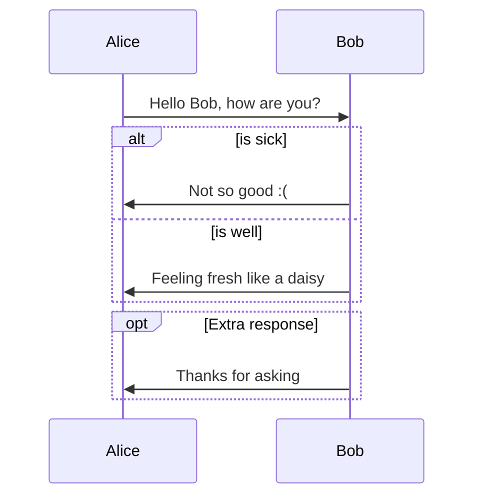
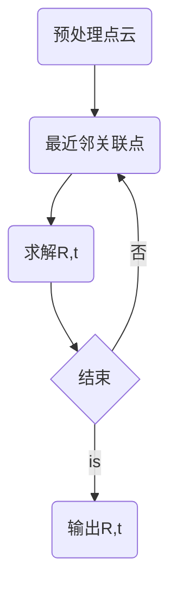

# 概述

主要应用场景

- 自动驾驶

  基于雷达的不同方案：

  - 基于高精地图（RoboTaxi）
  - 基于点云地图（观光、物流）（这是课程主线，即基于点云地图，如何更好的进行建图与更精准的定位）
  - 基于激光里程计（矿山）

- 机器人

  课程不会过多涉及，因为平面上的机器人（如扫地机器人）已经基本成熟了，二维slam技术已经足够

# 3D激光里程计

## 传感器原理

Lidar的分类:机械旋转激光雷达(如vlp16),固态激光雷达(如Livox Mid-40)

不同点

1. 视角范围不同

2. 扫描工作方式不同

   机械旋转激光雷达: 一般是多个激光束同时发射,并绕固定轴旋转,来探测三维环境
   缺点:远处的激光点之间的间隔较大

## 激光传感器原理

### 机械Lidar的工作方式

- 激光雷达传感器向周围环境发射脉冲光波;
-  这些脉冲碰撞到周围物体反弹并返回传感器;
- 传感器使用每个脉冲返回到传感器所花费的时间来计算其传播的距离
- 每秒重复数百万次此过程,将创建精确的实时3D环境地图

### 固态激光雷达

非重复扫描,它的扫描方式是梅花瓣状的

## 前端里程计

### 各种方案




### 基于直接匹配

点到点ICP-基于解析式求解（基于SVD）

点集：
$$
X=\{x_1,x_2,\cdots,x_{N_x}\}\\
Y=\{y_1,y_2,\cdots,y_{N_y}\}\\
$$
其中$X$和$Y$是原始点云的子集，选取的是两个点集中可以相互关联的那些点，即$N_x=N_y$

在这里我们认为两个点集是没有做好配准的，他们张的相似，之间是相差一个旋转平移的，我们需要找到这个关系（旋转平移关系），来实现
$$
minE(R,t)=min\frac{1}{N_y}\Vert x_i-Ry_i-t \Vert ^2
$$


一个合理思路是在一个点集里面选一些点，去寻找另一个点集里面最近的点，如果找的比较准确，可以计算出来旋转平移，那么配准计算就可以结束

但是实际上，因为一开始无法确定旋转平移关系，如果点找错了，那么旋转平移关系就会有误差，无法完全重合

所以有一个解决方案，就是匹配一次之后，肯定会比配准之前更准确，基于这种思路，进行多次配准即可



```flow
st=>start: 预处理点云
op=>operation: 最近邻关联点
o1=>operation: 求解R,t
cond=>condition: 结束
e=>end: 输出R,t
st->op->o1->cond
cond(yes)->e
cond(no)->op

```

所以可以不断进行配准，直到达到要求
$$
\begin{align}
E(R,t)&=\frac{1}{N_y}\sum\limits^{N_y}_{i=1}\Vert x_i-Ry_i-t-u_x+Ru_y+u_x-Ru_y \Vert ^2\\
&=\frac{1}{N_y}\sum\limits^{N_y}_{i=1}(\Vert x_i-u_x-R(y_i-u_y)+(u_x-Ru_y-t) \Vert )^2\\
&=\frac{1}{N_y}\sum\limits^{N_y}_{i=1}(\Vert x_i-u_x-R(y_i-u_y)\Vert^2+\Vert u_x-Ru_y-t \Vert^2 +2(x_i-u_x-R(y_i-u_y)))\\
\end{align}
$$
