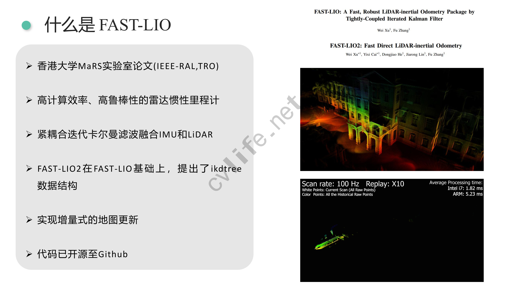

# 里程计标定

## 线性最小二乘法的基本原理

可以不关心底层的具体细节直接使用，但是最好基于自己的模型进行修改，这样效果更好，因为通用的标定方法在特定情况下的效果未必很好

线性方程组（工程里面最常见的情况）

- 为的矩阵
- 为的向量，是我们要求解的状态量，可以是：机器人的位姿，机器人特征点的位置
- 每一行表示一个约束，每一列表示一个自由度或者说未知数的维数
- 当的时候，约束正好，称为适定方程组，有唯一解（A可以有广义逆，所以必定有解）
- 当时，约束不足，称为欠定方程组，方程组有无穷多解
- 当时，约束过多，称为超定方程组，通常无解，也是实际情况中最经常碰到的情况
- 因为实际上我们一次采样的数量会非常多（每次采样就是一个约束），所以往往会得到一个超定方程组，因为噪声原因，他们彼此之间都是矛盾的，所以是无法得到一个解的

### 最小二乘解

- 绝大多数情况都是，是超定方程组
- 无解，但是我们可以寻找最接近真实解的解，也就是有最小二乘解
- 通解：
- 注意，在这里是一个病态的方程，这是因为给加一点微小的扰动，就会造成方程组解的巨大变化，所以在实际工程里面，我们会对进行一个QR分解来让解更稳定

### 线性空间角度看最小二乘法

- 表示的列向量空间，这是因为当取尽每一个值的时候，就表示的列向量张成的组合，即列向量空间，或者叫的列空间

- 方程组无解就意味着向量不在中

- 显然，最近的解即为：向量在中的投影

- 我们设为向量在空间中的投影，显然垂直于空间

- 显然与矩阵的每一个列向量都垂直，那么显然有
  

  即有

  

## 直线拟合

我们假设有这种理想情况：数据完美符合直线

但是实际上采样会混入噪声，所以我们有了采样数据

我们构建方程组：

即有

于是我们进行拟合

![](https://www.zhihu.com/equation?tex=%0AA%5ETA%3D%0A%5Cleft%20%5B%20%0A%5Cbegin%7Bmatrix%7D%0Ax_1%20%26x_2%26%20%5Ccdots%20%26x_n%5C%5C%0A1%261%26%5Ccdots%261%0A%5Cend%7Bmatrix%7D%0A%5Cright%5D%0A%2A%0A%5Cleft%20%5B%20%0A%5Cbegin%7Bmatrix%7D%0Ax_1%20%261%5C%5C%0Ax_2%20%261%5C%5C%0A%5Cvdots%20%26%20%5Cvdots%20%5C%5C%0Ax_n%20%261%5C%5C%0A%5Cend%7Bmatrix%7D%0A%5Cright%5D%0A%3D%0A%5Cleft%20%5B%20%0A%5Cbegin%7Bmatrix%7D%0A%5Csum%20%5Climits%20%5En_%7Bi%3D1%7Dx%5E2_i%20%26%5Csum%20%5Climits%20%5En_%7Bi%3D1%7Dx_i%20%5C%5C%0A%5Csum%20%5Climits%20%5En_%7Bi%3D1%7Dx_i%26n%5C%5C%20%0A%5Cend%7Bmatrix%7D%0A%5Cright%5D%0A%5C%5C%0A%28A%5ETA%29%5E%7B-1%7D%3D%0A%5Cleft%20%5B%20%0A%5Cbegin%7Bmatrix%7D%0A%5Cfrac%7B-n%7D%7BB%7D%20%26%5Cfrac%7B%5Csum%20%5Climits%20%5En_%7Bi%3D1%7Dx%5E2_i%20%7D%7BB%7D%20%20%5C%5C%0A%5Cfrac%7B%5Csum%20%5Climits%20%5En_%7Bi%3D1%7Dx_i%7D%7BB%7D%26%5Cfrac%7B%5Csum%20%5Climits%20%5En_%7Bi%3D1%7Dx%5E2_i%7D%7BB%7D%5C%5C%20%0A%5Cend%7Bmatrix%7D%0A%5Cright%5D%EF%BC%8C%E5%85%B6%E4%B8%ADB%3D%0A%28%5Csum%20%5Climits%20%5En_%7Bi%3D1%7Dx_i%29%5E2-n%5Csum%20%5Climits%20%5En_%7Bi%3D1%7Dx_i%5E2%0A%5C%5C%0A%E8%A7%A3%E5%BE%97%EF%BC%9Ax%3D%0A%5Cleft%20%5B%20%0A%5Cbegin%7Bmatrix%7D%0A%5Cfrac%7Bn%5Csum%20x_iy_i-%5Csum%20x_i%20%5Csum%20y_i%7D%7Bn%5Csum%20x_i%5E2-%5Csum%20x_i%5Csum%20x_i%7D%5C%5C%0A%5Cfrac%7B%5Csum%20x_i%5E2%5Csum%20y_i-%5Csum%20x_iy_i%5Csum%20x_i%7D%7Bn%5Csum%20x_i%5E2-%5Csum%20x_i%5Csum%20x_i%7D%0A%5Cend%7Bmatrix%7D%0A%5Cright%5D%0A)

代入数据有：

解得：

拟合效果如图

- 迭代最小二乘法

在实际过程中，数据不是一次性出现的，而是不断出现的

迭代最小二乘法的用处是可以不断进行标定，用于数据不断过来的情况

最小二乘法与卡尔曼滤波是有联系的，或者可以认为最小二乘法是一个滤波的过程（当卡尔曼滤波的过程噪声是0的时候，卡尔曼就是迭代最小二乘）

## 直接线性方法标定里程计

- 我们使用激光雷达的scan-match数据作为真值，因为我们认为激光雷达的观测值比里程计要准确，这里表示第帧和第帧之间的相对位姿关系，这里用表示第帧的位姿，于是有

- 里程计测量得到的数据为

- 假设他们之间成线性关系

  其中：因为我们是在二维平面上进行标定，所以这些都是三维向量，
  

  

（因为我们认为里程计是有累计误差的，是不准确的，所以我们需要一种更准确的方式来校准里程计，我们这里使用scan-match也就是使用激光雷达的扫描数据计算里程计，即激光里程计，显然这种方式没有累计误差，会更准确。在这里我们不考虑如何计算激光里程计或者激光里程计是怎么来的，我们只需要知道有这种里程计可以使用即可）

对于每一组数据，可得

![](https://www.zhihu.com/equation?tex=%0Au_%7Bix%7D%2Ax_%7B11%7D%2Bu_%7Biy%7D%2Ax_%7B12%7D%2Bu_%7Bi%5Ctheta%7D%2Ax_%7B13%7D%3Du_%7Bix%7D%5E%2A%5C%5C%0Au_%7Bix%7D%2Ax_%7B21%7D%2Bu_%7Biy%7D%2Ax_%7B22%7D%2Bu_%7Bi%5Ctheta%7D%2Ax_%7B23%7D%3Du_%7Biy%7D%5E%2A%5C%5C%0Au_%7Bix%7D%2Ax_%7B31%7D%2Bu_%7Biy%7D%2Ax_%7B32%7D%2Bu_%7Bi%5Ctheta%7D%2Ax_%7B33%7D%3Du_%7Bi%5Ctheta%7D%5E%2A%5C%5C%0A%5Cleft%5B%0A%5Cbegin%7Bmatrix%7D%0Au_%7Bix%7D%26u_%7Biy%7D%26u_%7Bi%5Ctheta%7D%260%260%260%260%260%260%5C%5C%0A0%260%260%26u_%7Bix%7D%26u_%7Biy%7D%26u_%7Bi%5Ctheta%7D%260%260%260%5C%5C%0A0%260%260%260%260%260%26u_%7Bix%7D%26u_%7Biy%7D%26u_%7Bi%5Ctheta%7D%5C%5C%0A%5Cend%7Bmatrix%7D%0A%5Cright%5D%0A%5Cleft%5B%0A%5Cbegin%7Bmatrix%7D%0Ax_%7B11%7D%5C%5C%0A%5Cvdots%5C%5C%0Ax_%7B33%7D%0A%5Cend%7Bmatrix%7D%0A%5Cright%5D%0A%3D%0A%5Cleft%5B%0A%5Cbegin%7Bmatrix%7D%0Au_%7Bix%7D%5E%2A%5C%5C%0Au_%7Biy%7D%5E%2A%5C%5C%0Au_%7Bi%5Ctheta%7D%5E%2A%5C%5C%0A%5Cend%7Bmatrix%7D%0A%5Cright%5D%5C%5C%0AA%3D%0A%5Cleft%5B%0A%5Cbegin%7Bmatrix%7D%0AA_1%5C%5C%0A%5Cvdots%5C%5C%0AA_n%5C%5C%0A%5Cend%7Bmatrix%7D%0A%5Cright%5D%0A%5Chspace%7B3em%7D%0Ab%3D%0A%5Cleft%5B%0A%5Cbegin%7Bmatrix%7D%0Ab_1%5C%5C%0A%5Cvdots%5C%5C%0Ab_n%5C%5C%0A%5Cend%7Bmatrix%7D%0A%5Cright%5D%0A%5Chspace%7B3em%7D%0A%5Cvec%7BX%7D%3D%28A%5ETA%29%5E%7B-1%7DA%5ETb%0A)

如果想使用直接线性方法实现里程计标定，可以进行如下计算，首先有两个里程计位姿，$O_i$ 和 $O_j$，因为里程计的位姿是积分计算出来的，所以不可能有一个增量，所以要求出 i 坐标系在 j 坐标系中的位姿，也叫 $D_{pose}$，这个可以使用 PL-ICP 方法计算

# 激光雷达运动畸变去除

## 激光雷达传感器介绍

### 测距原理

激光雷达的测距原理主要是两种

1. 三角测距
2. 飞行时间法（TOF）

#### 三角测距法

三角法的原理如下图所示，

激光头Laser与摄像头在同一水平线（称为基准线）上，其距离为s，摄像头焦距为f，激光头与基准线的夹角为β。这些数据是已知的，在制造的时候就确定了。

在这里，d和q是未知的。我们要求出来物体和雷达之间的距离d。

激光器Laser发射激光，在照射到物体Object后，反射回摄像头成像平面的位置为点P，由于激光器和摄像头间隔了一段距离，所以依照光学路径，不同距离的物体将会成像在不同的位置。按照三角公式进行计算，就能推导出被测物体的距离

在这里，摄像头观测到激光的时候，激光穿过焦点，在成像平面上的位置为P，离焦点在垂点

### 对比

**三角测距**

- 中近距离精度较高
- 价格便宜，最低几百块钱
- 远距离精度较差
- 易受干扰
- 一般室内使用

**飞行时间法**

- 测距范围广，可以有几百米
- 测距精度高
- 抗干扰能力强
- 价格昂贵，一般上万甚至更高
- 室内室外都可以

## 激光雷达数学模型

## 运动畸变介绍

## 畸变去除方法

### 纯估计方法

### 里程计辅助方法

# FAST-LIO2框架

为什么要学习FAST-LIO2呢

总的来说有以下几个好处

- 性能优越，可以说是目前最先进的LIO框架之一
- 知识全面，涵盖了大部分多传感器融合所需要的知识，有助于理解其他的多传感器融合框架
- 代码可读性较好，适合初学者上手
