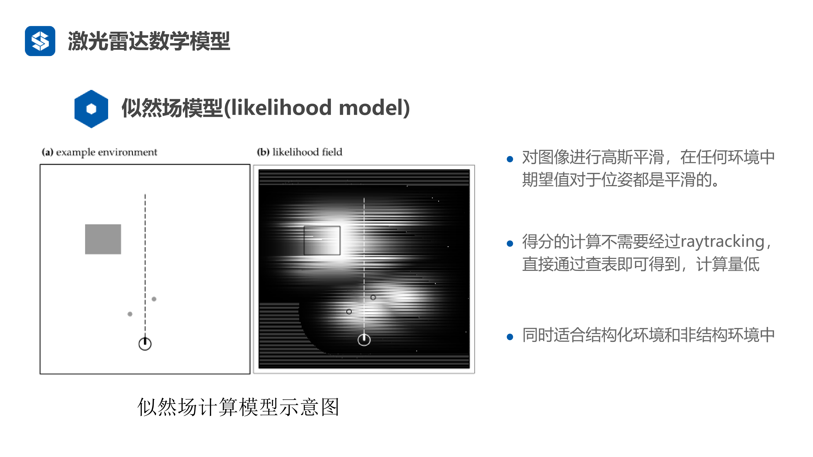
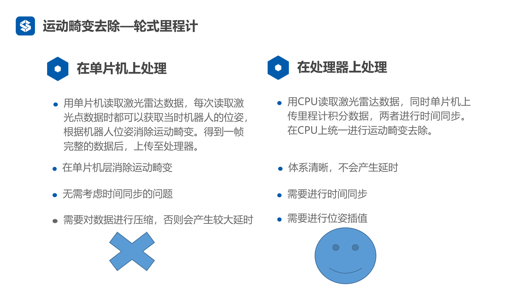
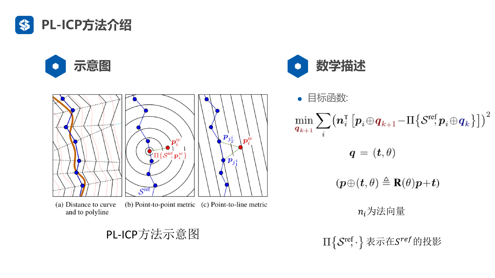

# 里程计标定

## 线性最小二乘法的基本原理

可以不关心底层的具体细节直接使用，但是最好基于自己的模型进行修改，这样效果更好，因为通用的标定方法在特定情况下的效果未必很好

线性方程组（工程里面最常见的情况）

- 为的矩阵
- 为的向量，是我们要求解的状态量，可以是：机器人的位姿，机器人特征点的位置
- 每一行表示一个约束，每一列表示一个自由度或者说未知数的维数
- 当的时候，约束正好，称为适定方程组，有唯一解（A可以有广义逆，所以必定有解）
- 当时，约束不足，称为欠定方程组，方程组有无穷多解
- 当时，约束过多，称为超定方程组，通常无解，也是实际情况中最经常碰到的情况
- 因为实际上我们一次采样的数量会非常多（每次采样就是一个约束），所以往往会得到一个超定方程组，因为噪声原因，他们彼此之间都是矛盾的，所以是无法得到一个解的

### 最小二乘解

- 绝大多数情况都是，是超定方程组
- 无解，但是我们可以寻找最接近真实解的解，也就是有最小二乘解
- 通解：
- 注意，在这里是一个病态的方程，这是因为给加一点微小的扰动，就会造成方程组解的巨大变化，所以在实际工程里面，我们会对进行一个QR分解来让解更稳定

### 线性空间角度看最小二乘法

- 表示的列向量空间，这是因为当取尽每一个值的时候，就表示的列向量张成的组合，即列向量空间，或者叫的列空间

- 方程组无解就意味着向量不在中

- 显然，最近的解即为：向量在中的投影

- 我们设为向量在空间中的投影，显然垂直于空间

- 显然与矩阵的每一个列向量都垂直，那么显然有
  

  即有

  

## 直线拟合

我们假设有这种理想情况：数据完美符合直线

但是实际上采样会混入噪声，所以我们有了采样数据

我们构建方程组：

即有

于是我们进行拟合

![](https://www.zhihu.com/equation?tex=%0AA%5ETA%3D%0A%5Cleft%20%5B%20%0A%5Cbegin%7Bmatrix%7D%0Ax_1%20%26x_2%26%20%5Ccdots%20%26x_n%5C%5C%0A1%261%26%5Ccdots%261%0A%5Cend%7Bmatrix%7D%0A%5Cright%5D%0A%2A%0A%5Cleft%20%5B%20%0A%5Cbegin%7Bmatrix%7D%0Ax_1%20%261%5C%5C%0Ax_2%20%261%5C%5C%0A%5Cvdots%20%26%20%5Cvdots%20%5C%5C%0Ax_n%20%261%5C%5C%0A%5Cend%7Bmatrix%7D%0A%5Cright%5D%0A%3D%0A%5Cleft%20%5B%20%0A%5Cbegin%7Bmatrix%7D%0A%5Csum%20%5Climits%20%5En_%7Bi%3D1%7Dx%5E2_i%20%26%5Csum%20%5Climits%20%5En_%7Bi%3D1%7Dx_i%20%5C%5C%0A%5Csum%20%5Climits%20%5En_%7Bi%3D1%7Dx_i%26n%5C%5C%20%0A%5Cend%7Bmatrix%7D%0A%5Cright%5D%0A%5C%5C%0A%28A%5ETA%29%5E%7B-1%7D%3D%0A%5Cleft%20%5B%20%0A%5Cbegin%7Bmatrix%7D%0A%5Cfrac%7B-n%7D%7BB%7D%20%26%5Cfrac%7B%5Csum%20%5Climits%20%5En_%7Bi%3D1%7Dx%5E2_i%20%7D%7BB%7D%20%20%5C%5C%0A%5Cfrac%7B%5Csum%20%5Climits%20%5En_%7Bi%3D1%7Dx_i%7D%7BB%7D%26%5Cfrac%7B%5Csum%20%5Climits%20%5En_%7Bi%3D1%7Dx%5E2_i%7D%7BB%7D%5C%5C%20%0A%5Cend%7Bmatrix%7D%0A%5Cright%5D%EF%BC%8C%E5%85%B6%E4%B8%ADB%3D%0A%28%5Csum%20%5Climits%20%5En_%7Bi%3D1%7Dx_i%29%5E2-n%5Csum%20%5Climits%20%5En_%7Bi%3D1%7Dx_i%5E2%0A%5C%5C%0A%E8%A7%A3%E5%BE%97%EF%BC%9Ax%3D%0A%5Cleft%20%5B%20%0A%5Cbegin%7Bmatrix%7D%0A%5Cfrac%7Bn%5Csum%20x_iy_i-%5Csum%20x_i%20%5Csum%20y_i%7D%7Bn%5Csum%20x_i%5E2-%5Csum%20x_i%5Csum%20x_i%7D%5C%5C%0A%5Cfrac%7B%5Csum%20x_i%5E2%5Csum%20y_i-%5Csum%20x_iy_i%5Csum%20x_i%7D%7Bn%5Csum%20x_i%5E2-%5Csum%20x_i%5Csum%20x_i%7D%0A%5Cend%7Bmatrix%7D%0A%5Cright%5D%0A)

代入数据有：

解得：

拟合效果如图

- 迭代最小二乘法

在实际过程中，数据不是一次性出现的，而是不断出现的

迭代最小二乘法的用处是可以不断进行标定，用于数据不断过来的情况

最小二乘法与卡尔曼滤波是有联系的，或者可以认为最小二乘法是一个滤波的过程（当卡尔曼滤波的过程噪声是0的时候，卡尔曼就是迭代最小二乘）

## 直接线性方法标定里程计

- 我们使用激光雷达的scan-match数据作为真值，因为我们认为激光雷达的观测值比里程计要准确，这里表示第帧和第帧之间的相对位姿关系，这里用表示第帧的位姿，于是有

- 里程计测量得到的数据为

- 假设他们之间成线性关系

  其中：因为我们是在二维平面上进行标定，所以这些都是三维向量，
  

（因为我们认为里程计是有累计误差的，是不准确的，所以我们需要一种更准确的方式来校准里程计，我们这里使用scan-match也就是使用激光雷达的扫描数据计算里程计，即激光里程计，显然这种方式没有累计误差，会更准确。在这里我们不考虑如何计算激光里程计或者激光里程计是怎么来的，我们只需要知道有这种里程计可以使用即可）

对于每一组数据，可得

![](https://www.zhihu.com/equation?tex=%0Au_%7Bix%7D%2Ax_%7B11%7D%2Bu_%7Biy%7D%2Ax_%7B12%7D%2Bu_%7Bi%5Ctheta%7D%2Ax_%7B13%7D%3Du_%7Bix%7D%5E%2A%5C%5C%0Au_%7Bix%7D%2Ax_%7B21%7D%2Bu_%7Biy%7D%2Ax_%7B22%7D%2Bu_%7Bi%5Ctheta%7D%2Ax_%7B23%7D%3Du_%7Biy%7D%5E%2A%5C%5C%0Au_%7Bix%7D%2Ax_%7B31%7D%2Bu_%7Biy%7D%2Ax_%7B32%7D%2Bu_%7Bi%5Ctheta%7D%2Ax_%7B33%7D%3Du_%7Bi%5Ctheta%7D%5E%2A%5C%5C%0A%5Cleft%5B%0A%5Cbegin%7Bmatrix%7D%0Au_%7Bix%7D%26u_%7Biy%7D%26u_%7Bi%5Ctheta%7D%260%260%260%260%260%260%5C%5C%0A0%260%260%26u_%7Bix%7D%26u_%7Biy%7D%26u_%7Bi%5Ctheta%7D%260%260%260%5C%5C%0A0%260%260%260%260%260%26u_%7Bix%7D%26u_%7Biy%7D%26u_%7Bi%5Ctheta%7D%5C%5C%0A%5Cend%7Bmatrix%7D%0A%5Cright%5D%0A%5Cleft%5B%0A%5Cbegin%7Bmatrix%7D%0Ax_%7B11%7D%5C%5C%0A%5Cvdots%5C%5C%0Ax_%7B33%7D%0A%5Cend%7Bmatrix%7D%0A%5Cright%5D%0A%3D%0A%5Cleft%5B%0A%5Cbegin%7Bmatrix%7D%0Au_%7Bix%7D%5E%2A%5C%5C%0Au_%7Biy%7D%5E%2A%5C%5C%0Au_%7Bi%5Ctheta%7D%5E%2A%5C%5C%0A%5Cend%7Bmatrix%7D%0A%5Cright%5D%5C%5C%0AA%3D%0A%5Cleft%5B%0A%5Cbegin%7Bmatrix%7D%0AA_1%5C%5C%0A%5Cvdots%5C%5C%0AA_n%5C%5C%0A%5Cend%7Bmatrix%7D%0A%5Cright%5D%0A%5Chspace%7B3em%7D%0Ab%3D%0A%5Cleft%5B%0A%5Cbegin%7Bmatrix%7D%0Ab_1%5C%5C%0A%5Cvdots%5C%5C%0Ab_n%5C%5C%0A%5Cend%7Bmatrix%7D%0A%5Cright%5D%0A%5Chspace%7B3em%7D%0A%5Cvec%7BX%7D%3D%28A%5ETA%29%5E%7B-1%7DA%5ETb%0A)

如果想使用直接线性方法实现里程计标定，可以进行如下计算，首先有两个里程计位姿， 和 ，因为里程计的位姿是积分计算出来的，所以不可能有一个增量，所以要求出 i 坐标系在 j 坐标系中的位姿，也叫 ，这个可以使用 PL-ICP 方法计算

# 激光雷达数学模型

## 光束模型

我们将激光看做激光束，如机器人通过激光束观测到一堵墙，并期望达到一定的距离，这个期望的距离就是通过光束模型来计算和预测的，但是一般情况下会存在噪声，所以一般遵守高斯分布，这也是最常见的情况；还有一种常见情况就是存在障碍物，所以测得的距离偏短，这种情况下认为遵守指数分布

然后是两种意外情况，比如说直接出现误差达到最大值或者误差均匀分布，但是这两种情况基本上不存在，所以可以忽略

当然，实际上激光雷达数学模型就是激光雷达的观测模型，认为在 t 时刻的位置  和地图  下，激光雷达观测到  这一帧的概率，同时我们认为每一个激光束相互独立，所以可以拆解为下面公式，因为实际上观测到的一帧实际上就是观测到若干个点

当然也可以把上面的概率记为得分，描述观测帧与地图重合的程度，这实际上就是我们的观测模型，而光束模型实际上是没人使用的，原因有二

1. 期望值的计算需要用raytracing，每一个位姿需要进行N此raytracing，N为一帧激光的激光束数量。但是这个 raytracing 非常依赖结构化环境
2. 在非结构化环境中（clutter），位姿微小的改变会造成期望值的巨大变化，从而导致得分进行突变，相对于位姿是非常不平滑和病态的，这可能导致位置估计的不稳定

## 似然场模型

考虑到传感器噪声和位姿噪声，合到一起得到一个高斯核对地图进行高斯平滑处理，如此就不需要计算期望值了

并且结构化环境和非结构化环境都可以使用

## 

### 测距原理

激光雷达的测距原理主要是两种

1. 三角测距
2. 飞行时间法（TOF）

#### 三角测距法

三角法的原理如下图所示，

激光头Laser与摄像头在同一水平线（称为基准线）上，其距离为s，摄像头焦距为f，激光头与基准线的夹角为β。这些数据是已知的，在制造的时候就确定了。

在这里，d和q是未知的。我们要求出来物体和雷达之间的距离d。

激光器Laser发射激光，在照射到物体Object后，反射回摄像头成像平面的位置为点P，由于激光器和摄像头间隔了一段距离，所以依照光学路径，不同距离的物体将会成像在不同的位置。按照三角公式进行计算，就能推导出被测物体的距离

在这里，摄像头观测到激光的时候，激光穿过焦点，在成像平面上的位置为P，离焦点在垂点

### 对比

**三角测距**

- 中近距离精度较高
- 价格便宜，最低几百块钱
- 远距离精度较差
- 易受干扰
- 一般室内使用

**飞行时间法**

- 测距范围广，可以有几百米
- 测距精度高
- 抗干扰能力强
- 价格昂贵，一般上万甚至更高
- 室内室外都可以

## 激光雷达数学模型

# 运动畸变

当机器人在移动过程中进行激光雷达扫描时，由于激光雷达的扫描速度与机器人的移动速度不匹配或者说扫描频率较低，导致扫描数据出现扭曲或变形，这是因为激光雷达扫描一帧数据需要一定时间而非瞬间完成，如果在这段时间内机器人发生移动，则扫描数据会反映机器人在不同位置的信息，从而产生畸变。其中以机器人旋转时产生的畸变最严重，单纯移动产生的畸变相对影响较小，同时帧率较低时，机器人的运动更不能忽略

## 畸变去除方法

一种是单纯依赖雷达的方法，一种是引入外部传感器或者观测的方法

### 纯估计方法

假设有两帧点云，并且两帧点云中的点是匹配的（每对匹配的点云都指向了物理空间中的同一个点），然后就可以使用 ICP 方法进行匹配，进而估计位姿变换，这里 ICP 可以得到解析解

实际上就是先求两帧点云的平均位置，然后进行位姿的归一化（减去平均位置）后进行相乘，得到一个矩阵并且进行 SVD 分解，进而可以得到旋转矩阵等，具体方法可以读 ICP 原始论文等

当然很大的问题就是难以知道对应的点（也有可能没有对应的点），所以难以一步完成计算，只能迭代计算（也就变成了 EM 算法，实际上 ICP 算法就是 EM 算法的特例，EM 算法的流程就是固定一个，求另一个，然后固定另一个，求这一个，反复迭代），并且因为存在畸变情况，所以数据可能都是错误的，导致了 ICP 方法难以应用

## VICP方法

所以有了新的方法，VICP，这是一种考虑了机器人运动的方法，这种方法会校正激光的运动畸变，在匹配的同时也会估计机器人的速度，不过其假设机器人是匀速运动，相对于激光较低的频率，这种假设并不成立，不过总的来说比 ICP 更加良好

首先有两帧点云  和 ，也就是第 i 帧和第 i-1 帧，然后相应的位姿矩阵为  和 ，然后可以根据李代数计算出机器人的速度，其中的的时间差是每一帧中两次点云的时间差

然后就可以得到第 i 帧的时刻表，然后可以对李代数进行切分并转化为李群也就是旋转矩阵，并矫正点云，之后再进行 ICP

### 里程计辅助方法

VICP 中，匀速运动假设难以成立，并且数据预处理和状态估计过程耦合（数据预处理和状态估计过程应分开，以便激光雷达数据可以被多个节点使用），解决方法就是寻找一种尽可能准确反映运动情况的方法，以及实现预处理和状态估计的解耦

这里可以使用里程计方法或者 IMU 方法，优点有三：

1. 里程计具有极高的位置更新频率，如200赫兹甚至1000赫兹（IMU)，能很好地反映机器人的运动情况。
2. 里程计在局部位置估计上具有较高的精度，非常适合在局部运动中计算
3. 里程计不需要激光雷达的位置估计，只需读取确认数据，再进行结果处理，可以跟姿态估计完全解耦

总的来说选择里程计，但是里程计也有两种处理方法，其中要注意的是，单片机和激光雷达连接的话会存在数据量过大而带宽不够用的情况，容易导致延时，需要进行数据压缩，但是单片机方法某种意义上可以完全消除畸变

这种方法的实现相对复杂一点，已知数据有：

- 当前帧激光的起止时间  和 
- 两个激光束之间的时间差 ，或者说是两个激光点之间的时间差，与扫描频率有关
- 里程计数据队列，按照时间顺序排列，队首的时间最早，并且里程计数据队列的时间区间包括了激光帧的时间区间

所以我们的任务就是：

- 求解当前帧激光数据中每一个激光点对应的机器人位姿
- 根据求解的位姿把所有激光点转换到同一坐标系下
- 重新封装成一帧激光数据，发布出去

具体的计算实际上分为两步：

- 第一步是求解中间时刻的位姿，基于线性插值的方法和起止时刻的位姿，计算出来中间任意时刻的位姿，比如说在 l、k 时刻有位姿  、，则 s 时刻位姿为 

- 第二步有两种方法

  - 第一个方法就是二次插值，在一帧激光数据之间，认为机器人做匀加速运动，那么位姿就是时间的二次函数，所以要进行拟合求解这个二次函数的参数，然后就可以计算出此帧激光时间内的位姿函数了，然后带入时间就可以直接计算出不同时刻的位姿了

  - 第二个方法就是二次曲线的近似，使用分段线性函数对二次函数进行近似，当分段数足够高的时候，近似误差可以忽略不计，方法就是在一段非线性函数中取若干个值，然后使用这些值代替不同小区间的非线性函数来进行计算

    方法是在此帧激光的时间段内，对里程计进行线性插值取 k 个位姿，然后在这些位姿直接再次进行插值计算，得到每个激光点对应时刻的位姿

# 前端配准

在视觉中叫 Tracking，对SLAM的性能有很大影响，甚至决定能不能进行回环，因为如果前端配准不准，导致误差大，那么回到同一个位置的时候就导致无法回环，因为相对视觉SLAM可以使用特征描述符来判断是不是同一个图像，激光的区分度没有那么高，只能通过一个大的搜索框进行搜索，这就导致问题，如果位置误差大，那么搜索框就得大，进而计算量就很大，甚至在区分度低的情况下会形成错误的回环

前端配准不仅仅是帧间匹配，还可以有地图到激光帧的匹配

## ICP方法

基于 ICP 方法的好处就是有解析解，理论可以证明是最优

然后拆分为两项，并且第一项只与 R 有关，第二项与 R、t 有关，所以可以先求出一个误差最小化的 R，然后带入第二项得到相应的 t

## PL-ICP

这种方法与 ICP 思想一致，但是针对的是点到线的距离进行优化的，其发现了 ICP 中的问题，就是可能匹配的两个激光点实际上并不是扫到了同一个物理实体，可能是扫到了一个物体的不同部位，这也就是说算法本身带来了误差

室内环境通常是结构化环境，即譬如墙壁等有众多规则的曲面（以左图中的棕色连续曲线代表），而激光数据实际是对实际环境中曲面的离散采样，因此，最好的误差尺度就是**点到实际曲面的距离**。我们目前通过传感器已经知晓激光点云数据，实际的重点就是对环境中曲面的恢复。PL-ICP **采用分段线性的方式近似替代曲面**，从而获得激光点到实际曲面的距离。

- 
