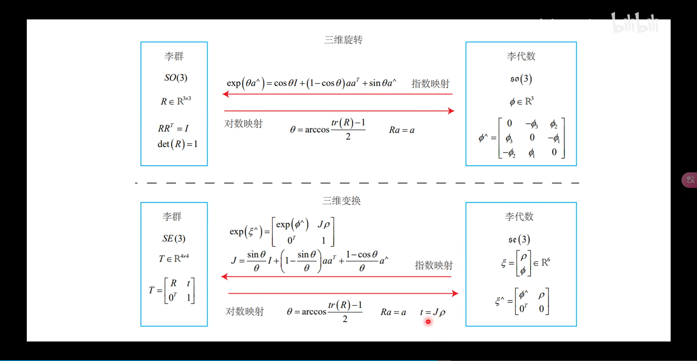
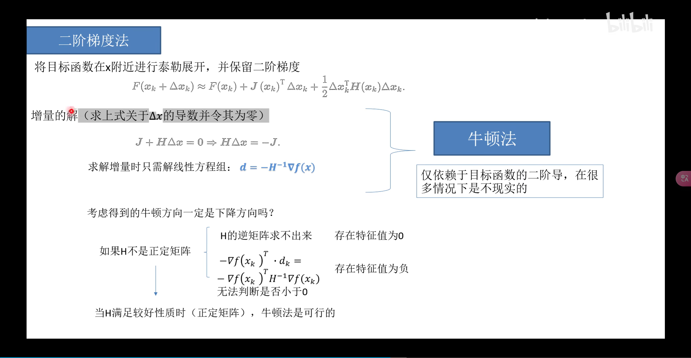
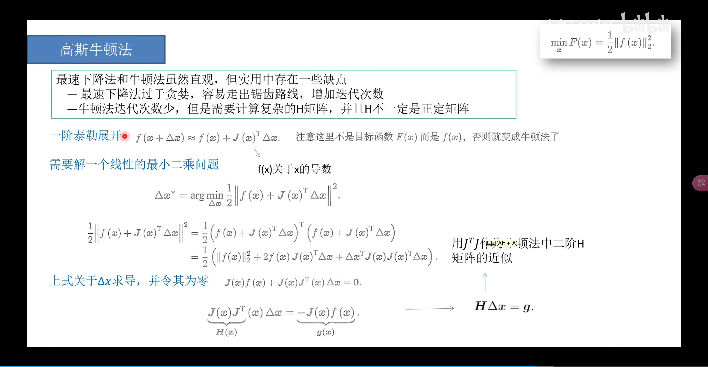
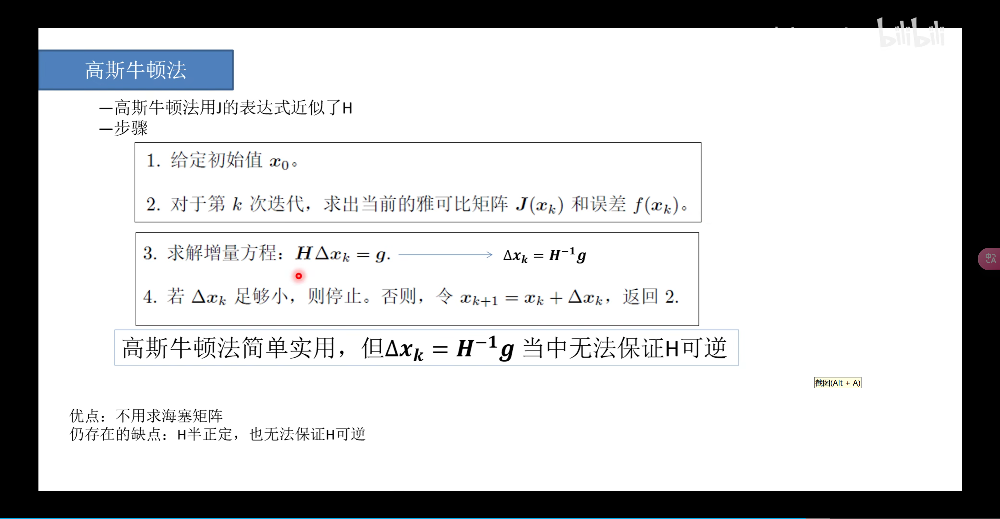
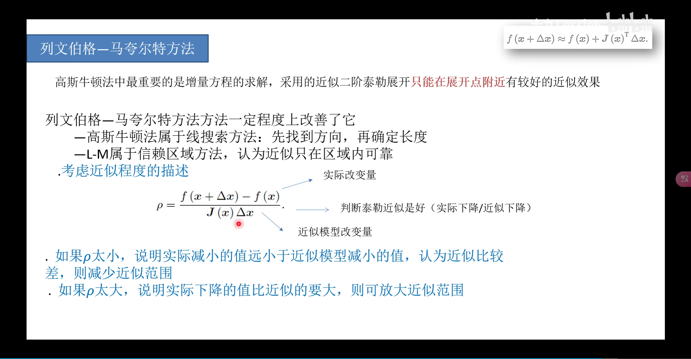
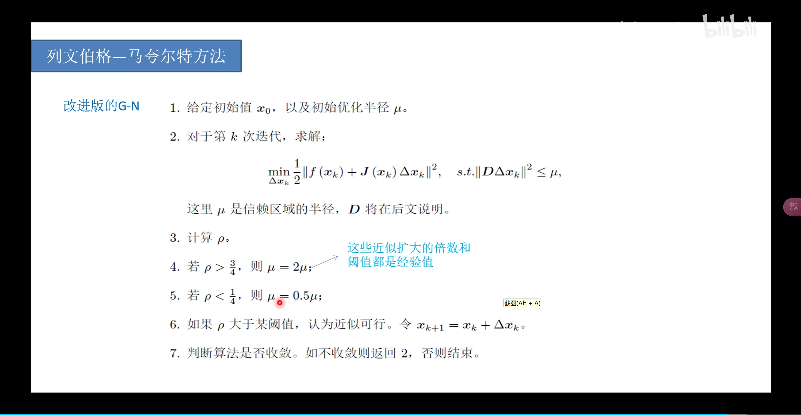
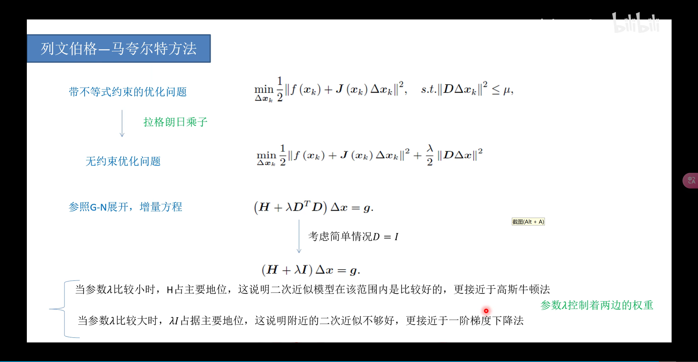
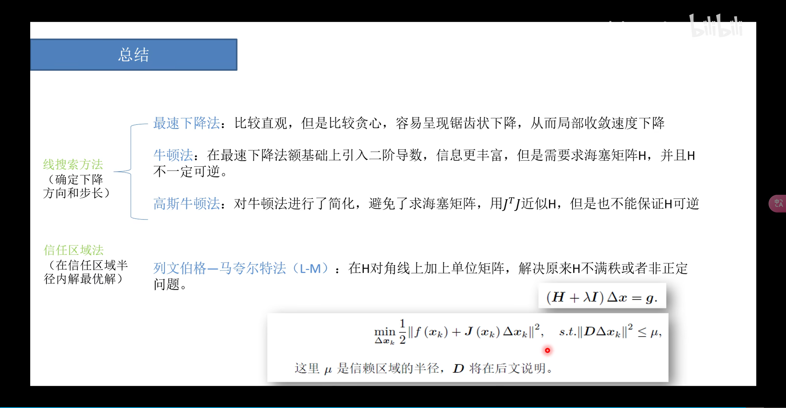
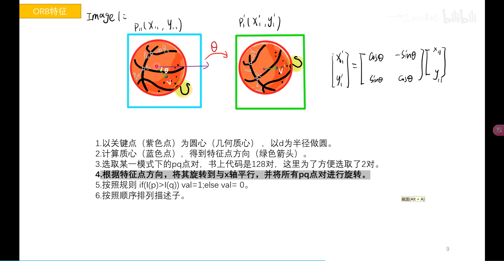

# 概述

这种机器人的自主运动过程中，有两大基本问题——我在什么地方？周围环境是什么样子的？也就是定位和建图的问题，而想完成定位与建图问题，就需要依靠传感器完成对外界环境的感知

传感器主要是有两种：

(1) 携带于机器人本体上的传感器，例：机器人的轮式编码器、相机、激光传感器、惯性测量单元(IMU)等

(2) 安装于环境之中的传感器，例：导轨、二维码标志等

但是环境传感器是有限制的，比如说GPS需要在能接收到卫星信号的环境下才可以工作

而本体上传感器具有以下优点：激光、相机等携带式传感器测量的通常都是一些间接的物理量而不是直接的位置数据，所以更加自由使用携带式传感器来完成SLAM也是我们重点关注的问题

## slam介绍

slam是什么呢？slam就是同时建图与定位，我们先不用学术的说法去介绍它，而是先用实际生活中的例子来介绍。

大家知道，如果你在一个地方生活久了，就会很熟悉这个地方，可能随便把你扔在其中某一个地点，你就可以知道你在什么位置，你应该怎么走回家，但是如果你出现在一个陌生的没去过的地方，你可能就一时半会不知道自己的位置了。

这个过程其实就是一个slam的过程，你在熟悉的环境下走路，相当于已经有一个地图在你大脑里面了，你需要根据眼睛看到的信息（相当于传感器感知环境）来判断自己在这个地图的什么地方，然后就可以进行自主导航了。

## 视觉传感器

视觉SLAM是本书的主题，所以我们非常关心小萝卜的眼睛能够做些什么事。即如何用相机解决定位和建图的问题。

- SLAM中使用的相机更加简单，以一定速率采集图像、形成视频,相机的特点就是以二维投影形式记录了三维世界的信息
- 但是该过程丢掉了一个维度：距离(或深度)

相机分类

- 单目相机 Monocular
- 双目相机(立体相机)Stereo
- 深度相机 RGB-D
- 其他 全景、Event Camera

## 单目相机

单目相机(只使用一个摄像头的相机)通过相机的运动形成视差，可以测量物体相对深度。

优点:结构简单，成本低，便于标定和识别

缺点:在单张图片里，无法确定一个物体的真实大小。它可能是一个很大但很远的物体，也可能是一个很近很小的物体。即单目SLAM估计的轨迹和地图将与真实的轨迹和地图相差一个因子也就是尺度(scale)，单凭图像无法确定这个真实尺度，所以称尺度不确定性。

## 双目相机

双目相机(由两个单目相机组成)通过基线来估计每个像素的空间位置。(类似于人眼)

优点:基线距离越大，能够测量的距离就越远;并且可以运用到室内和室外。

缺点:配置与标定较为复杂，深度量程和精度受到双目基线与分辨率限制，计算非常消耗计算资源，需要GPU(图形处理器)/FPGA设备(现场可编程门阵列)加速用两部相机来定位。

## 深度相机

深度相机(RGB-D)通过红外结构光或ToF(time of fly)的物理方法测量物体深度信息。

优点:相比于双目相机可节省大量的计算资源。

缺点:是测量范围窄，噪声大，视野小，易受日光干扰，无法测量透射材质等问题，主要用在室内，室外很难应用。
深度相机主要用来三维成像，和距离的测量。

## SLAM流程

1、传感器信息读取:在视觉SLAM中主要为相机图像信息的读取和预处理。

2、前端视觉里程计(Visual Odometry，Vo)视觉里程计的任务是估计相邻图像间相机的运动，以及局部地图的样子。(VO又称为前端)

3、回环检测(Loop Closure Detection)用于判断机器人是否到达过先前的位置。

4、后端(非线性)优化(optimization)。对不同时刻的视觉里程计测量的相机位姿及回环检测的信息进行优化，得到全局一致的轨迹和地图。

5、建图(Mapping)。根据估计的轨迹，建立任务要求对应的地图。

### 前端视觉里程计

视觉里程计通过相邻帧间的图像估计相机运动，并恢复场景的空间结构，但只计算相邻时刻的运动，不关心再往前的信息。但前端过程中必然存在误差，误差会不断累积，形成累积漂移(会发现原本直的走廊变成了斜的，而原本90°的直角变成一歪的)。为消除漂移，我们需要回环检测和后端优化。

### 后端优化

定义:如何处理前端所传噪声的数据，从带有噪声的数据中估计整个系统的状态，以及这个状态估计的不确定性有多大--称为最大后验概率估计

通常来说，前端给后端提供待优化的数据，以及这些数据的初始值。后端负责整体的优化过程，它往往面对的就只有数据。

反映了SLAM问题的本质:对运动主体自身和周围环境空间不确定性的估计。(状态估计理论一估计状态的均值和不确定性)

### 回环检测

回环检测的作用:主要解决位置估计随时间漂移的问题(通俗的理解就是，假设机器人经过一段时间又回到了原点(事实)，但是我们的位置估计值没有回到原点，怎么解决)

回环检测要达到的目标:通过某种手段，让机器人知道“回到原点”这件事情，让机器人具有识别到过的场景的能力。再把位置估计值“拉”过去

相机检测手段:判断与之前位置的差异，计算图像间相似性。

回环检测后:可将所得的信息告诉后端优化算法，把轨迹和地图调整到符合回环检测结果的样子。

### 地图

地图大体上可分为以下两类:

1. 度量地图(强调精确的表示地图中的位置关系)，常用稀疏与稠密进行分类
   稀疏地图:即由路标组成的地图
   稠密地图:着重于建模所有看到的东西(可用于导航)(耗费大量的储存空间)

2. 拓扑地图(更加强调元素之间的关系)

   是一个图:由节点和边组成

   例:只关注A、B点是连通的，而不考虑如何从A点到达B点，不适用于表达较为复杂结构的地图

## 传感器对比

激光雷达与相机对比

- 激光雷达有效距离远，可以达到百米级别（可达300m），相机有效距离相对近
- 雷达贵，动辄上万，相机较为便宜，高速相机不过上千
- 激光雷达受天气影响较大，雨雪都会成为巨大干扰，因为雨雪也会反射激光
- 雷达重，激光较轻
- 在纹理不清楚或者光线过强过弱的地方，相机几乎无法运作

## SLAM数学表述

关于运动模型:
机器人会携带一个测量自身运动的传感器，这个传感器可以测量有关运动的读数，但不一定直接就是位置之差，还可能是加速度、角速度这些信息。我们可以用一个抽象的数学模型来描述
$$
\overrightarrow{x_k}=f(\overrightarrow{x_{k-1}},\overrightarrow{u_k},\overrightarrow{w_k})
$$
u是运动传感器的读数，w是运动过程中加入的噪声，上面公式即运动方程

关于观测模型:

机器人在 $\overrightarrow{x_k}$ 位置上看到某个路标点 $\overrightarrow{y_j}$ ,产生了一个观测数据 $\overrightarrow{z_{k,j}}$ ，同样可以用一个抽象的数学模型描述:
$$
\overrightarrow{z_{k,j}}=h(\overrightarrow{y_j},\overrightarrow{x_k},\overrightarrow{v_{k,j}})
$$
其中 v 是可观测的噪声

实际上，这只是一个简化的方程，描述了一种形式，在真实世界中，根据机器人的真实运动和传感器的种类，存在着若干种参数化形式。而考虑视觉SLAM时，传感器是相机，则观测方程就是“对路标点拍摄后，得到图像中的像素”的过程

举个例子解释:假设机器人在平面运动，那么位姿(位置+姿态)由两个位置的坐标和一个转角来描述
$$
\overrightarrow{x_k}=(x,y,\theta)^T
$$
同时，运动传感器能够测量到机器人在任意两个时间间隔位置和转角的变化量
$$
\overrightarrow{u_k}=(\Delta x,\Delta y,\Delta \theta)^T
$$
于是，此时运动方程就可以写成
$$
\overrightarrow{x_k}=\overrightarrow{x_{k-1}}+\overrightarrow{u_k}+\overrightarrow{w_k}
$$
关于观测方程，比如机器人携带着一个二维激光传感器(当激光传感器观测一个2D路标点时，可以测到路标点与机器人之间的距离 $r$ 和夹角 $\phi$​)，记路标点
$$
\overrightarrow{y}=(y_1,y_2)^T
$$
位姿为
$$
\overrightarrow{x_k}=(x_1,x_2)^T
$$
观测数据为
$$
\overrightarrow{z_{k,j}}=(r_{k,j},\phi_{k,j})^T
$$
于是观测方程就可以写成:
$$
\begin{bmatrix}
r_{k,j}\\
\phi_{k,j}
\end{bmatrix}
=
\begin{bmatrix}
\sqrt{(\overrightarrow{y_{1,j}}-\overrightarrow{x_{1,k}})^2+(\overrightarrow{y_{2,j}}-\overrightarrow{x_{2,k}})^2}\\
\arctan(\frac{\overrightarrow{y_{2,j}}-\overrightarrow{x_{2,k}}}{\overrightarrow{y_{1,j}}-\overrightarrow{x_{1,k}}})
\end{bmatrix}
$$

# 三维空间刚体运动

想描述三维空间中的物体运动，就必须先确定坐标系的概念，因为运动都是相对的，我们无法描述一个物体的绝对运动情况，只能描述一个物体的相对运动情况

## 点与坐标系

三维空间由3个轴组成，则一个空间点的位置可以由3个坐标指定

对于一个刚体(在运动和受力作用后，形状和大小不变，而且内部各点的相对位置不变的物体)，不光有位置，还有自身的姿态，如相机可以看成三维空间中的刚体，则位置就是说相机在空间中的哪个地方，姿态是指相机的朝向(相机处于空间(0，0，0)处，朝向正前方)，这些情况都需要使用数学语言进行描述

点没有长度，没有体积，但是点和点可以组成向量

向量是带指向性的箭头(有方向性)，可以进行加法、减法等运算

### 坐标系

当我们指定坐标系后，才可以谈论该向量在此坐标系下的坐标

在机器人领域，一般使用右手系，机器人的运动也都是在右手系里面进行讨论

如我们在激光坐标系下观测到某些情况，在相机坐标系下拍摄到某些情况

### 向量运算

对于向量

定义内积（也就是点乘）：

定义外积（结果是一个与两个向量都垂直的向量）：

### 坐标变换

**问题**：如果我们在相机或者雷达坐标系下观测到一个对象，那么这个对象在世界坐标系下或者机器人坐标系下的位置是如何表示的呢？

这里就需要用数学公式来表述了，也就是坐标变换的问题：如何计算同一个向量在不同坐标系里的坐标？

实际上，两个坐标系之间的关系，只有旋转和平移两种，或者说，两个坐标系之间的欧式变换由旋转和平移组成

## 旋转矩阵

实际上，某个坐标系进行旋转，一个固定向量 $a$ 在旋转前后的坐标变化可以使用旋转矩阵 $R$​ 计算
$$
a=Ra^\prime
$$
中间的矩阵R为旋转矩阵，描述了两个坐标系的变换关系，可以证明：

R是一个正交矩阵，行列式为+1

取行列式为1的正交矩阵称为旋转矩阵
$$
SO(n)=\{R\in \mathbb{R}^{n\times n}|RR^T=I,det(R)=1\}
$$
其中 $SO(n)$​ 是特殊正交群

如果考虑平移关系，则有
$$
a=Ra^\prime+t
$$
这样就可以完整的描述旋转和平移的关系

## 旋转矩阵的左乘/右乘

旋转矩阵的左乘和右乘在数学和物理上有不同的意义，主要体现在旋转的顺序和方向上。

左乘旋转矩阵：这种表示方式通常用于主动旋转（active rotation），具有多重物理意义

1. 坐标系的旋转，其应用场景有SLAM，机械臂运动学等

即旋转向量本身。这意味着我们将向量 $v$ 看作是固定在一个坐标系中，然后对这个向量应用旋转矩阵 $R$ 来得到旋转后的向量 $v^\prime$。

例如，如果 $R$ 是一个绕 z 轴旋转的矩阵，左乘表示向量 $v$ 围绕 z 轴旋转。

右乘旋转矩阵：这种表示方式通常用于被动旋转（passive rotation），即旋转坐标系而不是向量。这意味着我们将向量 $v$ 看作是固定的，然后对坐标系应用旋转矩阵 $R$ 来得到旋转后的向量 $v^\prime$ （可以理解为在新坐标系下的坐标）。右乘通常用于描述坐标系的旋转，而不是旋转向量本身。

例如，如果 $R$ 是一个绕 z 轴旋转的矩阵，右乘表示坐标系围绕 z 轴旋转。

### 齐次坐标

虽然旋转矩阵可以表达欧式空间的旋转和平移，但是不是一种线性关系，多次变换的复合计算是多次叠加，很复杂，则可以使用齐次坐标改写变换矩阵

即：

$$
\begin{bmatrix}
a^\prime \\
1
\end{bmatrix}
=\begin{bmatrix}
R &t \\
0^T &1
\end{bmatrix}
\begin{bmatrix}
a\\
1
\end{bmatrix}
\triangleq
T
\begin{bmatrix}
a\\
1
\end{bmatrix}
$$
这样就简化了记忆和计算，多次变换可以直接进行乘法计算

这种用四个数表达三维向量的做法称为齐次坐标，引入齐次坐标后，旋转和平移可以放在同一个矩阵中，称为变换矩阵，变化矩阵的集合定义为
$$
SE(3)=\{
T=
\begin{bmatrix}
R &t \\
0^T &1
\end{bmatrix}
\in \mathbb{R}^{4\times 4}|R\in SO(3),t \in \mathbb{R}^3\}
$$
称为特殊欧式群，并且可以定义反向的变换
$$
T^{-1}=
\begin{bmatrix}
R^T &-R^Tt \\
0^T &1
\end{bmatrix}
$$
但是这种变换矩阵的方法是有缺陷的：

1. SO(3)的旋转矩阵有九个量，但一次旋转只有三个自由度。因此这种表达方式是冗余的。同理，变换矩阵用十六个量表达了六自由度的变换。那么，是否有更紧凑的表示呢?
2. 旋转矩阵自身带有约束:它必须是个正交矩阵,且行列式为 1。变换矩阵也是如此。当我们想要估计或优化一个旋转矩阵,变换矩阵时，这些约束会使得求解变得更困难。

## 旋转向量与欧拉角

#### 旋转向量——除了旋转矩阵之外的旋转表示

旋转矩阵表示旋转是冗杂的(旋转矩阵有9个量，但一次旋转只有3个自由度并且旋转矩阵自身带有约束)，所以有了新的表示方法——旋转向量，不过要注意一下，旋转向量与旋转矩阵只是表达方式不同，但是表达的内容是相同的
旋转向量：三自由度，用 $R^3$​ 向量表示，方向为旋转轴，长度为转过的角度，定义为
$$
\overrightarrow{w}=\theta \overrightarrow{n}
$$
其与旋转矩阵的转换方式为罗德里格斯公式
$$
\mathbf{R} = \cos \theta \mathbf{I} + (1 - \cos\theta) nn^T +\sin\theta n^\wedge
$$
而反过来，旋转矩阵转旋转向量为
$$
角度：\theta=\arccos(\frac{tr(R)-1}{2})\\
轴：Rn=n
$$
其中转轴是矩阵 R 特征值1对应的特征向量

实际上这个计算过程是这样的：

对于转角 $\theta$ ，取两边的迹，有
$$
\begin{aligned}
tr(R)&=\cos \theta tr(\mathbf{I}) + (1 - \cos\theta) tr(nn^T) +\sin\theta tr(n^\wedge)\\
&=3\cos\theta+(1-\cos\theta)\\
&=1+2\cos\theta
\end{aligned}
$$
关于转轴，旋转轴上的向量在旋转后不发生改变，说明
$$
Rn=n
$$
说明转轴是矩阵 R 特征值1对应的特征向量

具体的罗德里格斯公式的证明过程，可以考虑将向量分解为垂直于旋转向量和沿着旋转向量的分量，然后分别计算旋转之后的情况

#### 欧拉角

无论是旋转矩阵、旋转向量，虽然它们能描述旋转，但对我们人类是非常不直观的。当我们看到一个旋转矩阵或旋转向量时很难想象出来这个旋转究竟是什么样的。当它们变换时，我们也不知道物体是向哪个方向在转动。

而欧拉角提供了一种非常直观的方式
欧拉角将旋转分解为三次不同轴上的转动，以便理解

- 例如按照Z-Y-X转动
- 轴顺序亦可不同，因此存在许多种定义方式不同的欧拉角
- 其中ZYX 顺序（航向-俯仰-滚转）是常用的一种，顺序上首先围绕 z 轴旋转，接着围绕新的 y 轴旋转，最后围绕新的 x 轴旋转。广泛应用于航空航天和机器人学中，用来描述航向（yaw）、俯仰（pitch）和滚转（roll）。

实际上，欧拉角的定义方式比较多（XYZ三轴不同的先后顺序），而且会存在奇异性问题（万向锁这种），所以一般不会直接使用，在SLAM中也很少使用欧拉角表示姿态

#### 万向锁

这是欧拉角奇异性问题的一种体现，即旋转角在特定值的时候，会有两个旋转轴重合，这种情况下旋转自由度减一

由于万向锁问题，欧拉角不适合插值和迭代，往往用于人机交互中，并且可以证明，用三个实数来表达三维旋转时，会不可避免地碰到奇异性问题。所以SLAM程序中很少直接用欧拉角表示姿态

正常情况下

奇异情况下

在这种时候，两轴重合，会存在这种情况

但是，如果使用四个数来表达旋转，则不会出现这种情况，这也就是四元数的用处

### 四元数

这是一种节省空间（紧凑）而且没有奇异性的表达形式，可以用来描述旋转

2D 情况下，可用单位复数表达旋转

三维情况下，四元数就是复数的扩充

四元数（Quaternion）

**如何使用四元数描述旋转**

设有点，在经历了一次四元数表示的旋转之后，得到了，他们的关系如何表述

而如何使用四元数表示旋转呢？

任意单位向量v，沿着以单位向量定义的旋转轴u旋转 $\theta$ 度之后的 v 可以使用四元数乘法来得到，此时可以令 $v=[0,v]$，令 $p=[\cos \frac12\theta,u\sin \frac12\theta]$

则有：$v^\prime=pvp^*=pvp^{-1}$​

并且，变换后的四元数实部为0，虚部是罗德里格斯公式的结果

## 程序设计

使用动态矩阵的时候，运算会比较慢

# 李群和李代数

## 背景

在SLAM中，除了表示之外，还要对它们进行估计和优化，因为SLAM整个过程就是在不断地估计机器人的位姿与地图，该位姿是由 S0(3) 上的旋转矩阵或 SE(3) 上的变换矩阵描述的。为了做这件事，需要对变换矩阵进行插值、求导、迭代等操作，比如说当我们去估计相机位姿的时候，当估计不准确的时候，要对旋转和平移进行微调

比如说某个时刻，机器人的位姿为 $T_{cw}$，它观测到一个世界坐标位于 $P_w$ 的点，产生了一个观测数据 $Z_c$ ，根据坐标变换，有
$$
\forall i,Z_c=T_{cw}P_{wi}+w
$$
那我们实际要做的事情是求一个欧氏变换 $T_{cw}$，使得其满足上式。

然而，由于观测噪声 $w$ 的存在，$z$ 往往不可能精确地满足 $z= Tp$ 的关系。所以，我们通常会计算理想的观测与实际数据的误差：
$$
e=z-Tp
$$
假设一共有N个这样的路标点和观测，则就有N个上式，则对于机器人的位姿估计，相当于寻找一个最优的T，使得整体误差最小化：
$$

$$

但是我们可以发现，旋转矩阵是无法相加的，相加之后就不是一个旋转矩阵了，所以我们需要用一种新理论去完成这个操作。

### 问题

首先我们知道，运动是可以被观测的，也就是说，我们可以使用一个观测模型来描述，或者用一个变换矩阵来描述

但是，在SLAM中有一个问题，值是估计出来的，如果我们发现不准确，那么就应该进行调整，得到新的估计，那么我们设调整后的旋转平移为，设他们直接相差一个微小量，即有

但是，我们知道对乘法封闭，但是对加减是不封闭的，自然也没办法进行求导，因为优化是必须基于导数的，但是如果有一个函数，那么有

但是由于其性质，我们无法完成这个求导操作，自然无法完成优化

## 群

群是一种集合加上一种运算的代数结构，记集合为 $A$，运算为 $\cdot$，那么当运算满足以下性质时，称二元组 $(A,\cdot)$​ 成群

1. 封闭性：$\forall a_1,a_2\in A,a_1\cdot a_2 \in A$
2. 结合律：$\forall a_1,a_2,a_3\in A,(a_1\cdot a_2)\cdot a_3= a_1\cdot (a_2\cdot a_3)$
3. 幺元：$\exist a_0\in A,\forall a \in A,a_0\cdot a=a\cdot a_0=a$
4. 逆：$\forall a\in A,\exist a^{-1}\in A,a\cdot a^{-1}=a_0$

三维旋转矩阵构成了特殊正交群（Special Orthogonal Group）

三维变换矩阵的集合称为特殊欧式群（Special Euclidean Group)

一般线性群 $GL(n)$ 指 $n\times n$ 的可逆矩阵，它们对矩阵乘法成群。

## 李群概念

李群是具有连续性质的群，或者说这个群是光滑的，所以既是群也是流形

直观上看，一个刚体能够连续地在空间中运动，故和都是李群。

但是，和只有定义良好的乘法，没有加法，所以难以进行取极限、求导等操作。

## 李代数概念

李代数是与李群对应的一种结构，位于向量空间，对应李群的正切空间，描述了李群局部的导数，记作 $so(3)$ 和 $se(3)$

从旋转矩阵引出李代数

我们考虑任意旋转矩阵，满足

在连续运动过程中，显然是连续时间的函数，我们记为

两侧对时间求导

如果我们将看做一个整体，我们就发现其为一个反对称矩阵

我们记为

两边右乘

其中，消去后得到

可以看成求导之后，左侧多出一个，或者说，每对旋转矩阵求导一次，只需要左乘一个此矩阵（当然此矩阵不是一个常数)

这类似于指数函数的操作，变量的导数等于其本身乘以一个系数
$$
y=e^{kx}\rightarrow y^\prime=ke^{kx}\rightarrow y^\prime=ky
$$
从简单情况考虑，当 $t_0=0,R(0)=I$ 的时候
$$
\begin{aligned}
R(t)&\approx R(t_0)+\dot{R}(t_0)(t-t_0)\\
&=I+\phi(t_0)^\wedge(t)\\
\end{aligned}
$$
在这里，$\phi^\wedge$ 为 $R(t)$ 的李代数，是李群在单位元 $t_0$​ 处的正切空间

在 $t_0$ 附近，设 $\phi$ 保持为常数向量 $\phi(t_0)=\phi_0$​ ，则有微分方程
$$
\dot{R}(t)=\phi(t_0)^\wedge R(t)=\phi_0^\wedge R(t)
$$
已知初始情况，解得
$$
R(t)=\exp(\phi_0^\wedge t)
$$
$R(t)$ 与 $\phi$ 之间的关系称为指数映射，这里的 $\phi$ 称为 $SO(3)$ 对应的李代数： $so(3)$

但是新的问题来了，$so(3)$​ 的定义和性质是什么呢？这个指数映射应该怎么求呢

实际上每个李群都有与之对应的李代数，李代数描述了李群单位元数的正切空间性质。

李代数由一个集合 $\mathbb{V}$ ，一个数域 $\mathbb{F}$ 和一个二元运算 $[,]$ 组成。如果它们满足以下几条性质，称 $(\mathbb{V},\mathbb{F},[,])$为一个李代数，记作 $\mathfrak{g}$

1. 封闭性：$\forall X,Y\in \mathbb{V},[X,Y]\in \mathbb{V}$

2. 双线性： $\forall X,Y,Z\in \mathbb{V},a,b\in \mathbb{F}$，有

   $[aX+bY,Z]=a[X,Z]+b[Y,Z],[Z,aX+bY]=a[Z,X]+b[Z,Y]$

3. 自反性： $\forall X\in \mathbb V,[X,X]=0$

4. 雅可比等价： $\forall X,Y,Z\in \mathbb V,[X,[Y,Z]]+[Z,[Y,X]]+[Y,[Z,X]]=0$

二元运算被称为李括号，例子:三维空间向量+ R3 +叉积运算构成李代数

对于李群 SO(3)，有李代数 so(3)
$$
so(3)=\{\phi \in \mathbb{R}^3,\Phi=\phi^\wedge\in \mathbb R^{3\times 3}\}\\
\Phi=\phi^\wedge=
\begin{bmatrix}
0 & -\phi_3 &\phi_2\\
\phi_3 &0 & -\phi_1\\
-\phi_2 & \phi_1 & 0\\
\end{bmatrix}
\in \mathbb R ^{3\times 3}
$$
定义李括号
$$
[\phi_1,\phi_2]=(\Phi_1 \Phi_2-\Phi_2\Phi_1)^\wedge
$$
可以说李代数的元素是三维向量或者三维反对称矩阵，只不过向量形式更加自然一些

当然，对于变换矩阵的李群，也有相应的李代数
$$
SE(3)=\{
T=
\begin{bmatrix}
R &t \\
0^T &1
\end{bmatrix}
\in \mathbb{R}^{4\times 4}|R\in SO(3),t \in \mathbb{R}^3\}
$$
对应的李代数为 se(3)
$$

$$

## 指数映射

指数映射反映了从李代数到李群的对应关系，也就是有
$$
R=\exp(\phi^\wedge)
$$
$\phi^\wedge$ 是一个矩阵，任意矩阵的指数映射可以写成一个泰勒展开
$$
\exp(\phi^\wedge)=\sum^\infty_{n=0}\frac{1}{n!}(\phi^\wedge)^n
$$
其中 $\phi$ 是一个向量，可以定义模长 $\theta$ 和单位方向向量 $a$，也即 $\phi=\theta a$

其中，因为 $a$ 是单位向量，所以可以推导出以下性质
$$
a^\wedge a^\wedge=aa^T-I\\
a^\wedge a^\wedge a^\wedge=-a^\wedge
$$
这为化解展开式中的高阶项提供了有效方法
$$
\begin{aligned}
\exp(\phi^\wedge)&=\exp(\theta a^\wedge)=\sum^\infty_{n=0}\frac{1}{n!}(\theta a^\wedge)^n\\
&=I+\theta a^\wedge+\frac{1}{2!}\theta^2 a^\wedge a^\wedge+\frac{1}{3!}\theta^3 a^\wedge a^\wedge a^\wedge+\cdots\\
&=aa^T-a^\wedge a^\wedge+\theta a^\wedge+\frac{1}{2!}\theta^2 a^\wedge a^\wedge-\frac{1}{3!}\theta^3 a^\wedge +\cdots\\
&=aa^T+(\theta-\frac{1}{3!}\theta^3+\frac{1}{5!}\theta^5+\cdots)a^\wedge-(1-\frac{1}{2!}\theta^2+\frac{1}{4!}\theta^4-\cdots)a^\wedge a^\wedge\\
&=a^\wedge a^\wedge+I+a^\wedge\sin \theta -a^\wedge a^\wedge \cos \theta\\
&=(1-\cos \theta) a^\wedge a^\wedge +I +a^\wedge \sin \theta\\
&= \cos \theta \mathbf{I} + (1 - \cos\theta) aa^T +\sin\theta a^\wedge
\end{aligned}
$$
实际上这是一个似曾相识的结果——罗德里格斯公式

so(3) 的物理意义就是旋转向量，即so(3)的李代数空间就是由旋转向量组成的线性空间。如果李群(旋转矩阵，R(t)，类似一个函数)代表一个球面，那么球上所有点的切线(单位元处李群的切空间李代数，旋转向量)，也会组成一个球面，而且这个球面和原来的球面一样。

## BCH公式

在估计和优化过程中，求导数是非常必要的。但是李群元素只有乘法，无法定义导数($R_1+R_2\notin SO(3) $)

已知SO(3)和SE(3)上的李群和李代数关系，但是当SO(3)中完成两个矩阵乘法时，李代数so(3)上发生什么变化？换言之，当so(3)上做两个李代数相加时，SO(3)上是否对应着两个矩阵的乘积？

两个李代数指数映射乘积的完整形式，由BCH公式给出，由于完整形式复杂，只给出展开的前几项：
$$
\ln (\exp (A)\exp (B))= A+ B + \frac12[A, B] + \frac 1 {12}[A, [A, B]| -  \frac 1 {12}[B, [A, B]]+\cdots
$$
当处理两个矩阵指数之积时，会产生一些由李括号组成的余项。为了便于计算，当其中一个量很小的时候，可以忽略高阶项，做成线性近似形式
$$
\ln (\exp (\phi_1^\wedge)\exp (\phi_2^\wedge))^\vee=
\begin{cases}
J_l(\phi_2)^{-1}\phi_1+\phi_2 \quad if \quad\phi_1\quad small \\
J_r(\phi_1)^{-1}\phi_2+\phi_1 \quad if \quad\phi_2\quad small
\end{cases}
$$
理解一下这个式子：当对一个旋转矩阵 $R_2$(李代数为 $\phi_2$)左乘一个微小旋转矩阵 $R_1$(李代数为 $\phi_1$)时，可以近似的看作，在原有的李代数 $\phi_2$ 上，加上了一项  $J_l(\phi_2)^{-1}\phi_1$，其中
$$
J_l=J=\frac{\sin \theta}{\theta}I+(1-\frac{\sin \theta}{\theta})aa^T+\frac{1-\cos \theta}{\theta}a^\land\\
J_l^{-1}=\frac{\theta}{2}\cot \frac{\theta}{2} I+(1-\frac{\theta}{2}\cot \frac{\theta}{2})aa^T+\frac{\theta}{2}\theta a^\land\\
J_r(\phi)=J_l(-\phi)
$$

某个旋转 $R$，对应的李代数为 $\phi$，给它左乘一个微小旋转，记作 $\Delta R$，则对应的李代数为 $\Delta \phi$
在李群上，得到的为 $\Delta R\cdot R$，而在李代数上，根据BCH近似，为 $J_l(\phi)^{-1}\Delta\phi+\phi$

如果在李群上定义了左乘小量，那么李代数上的加法相差左雅可比的逆
$$
\exp (\Delta\phi^\wedge)\exp (\phi^\wedge)=\exp((J_l(\phi)^{-1}\Delta\phi+\phi)^\wedge)
$$
反之，在李代数上进行小量加法的时候，李群上相差一个一个左右的雅可比
$$
\exp((\phi+\Delta\phi)^\wedge)
=\exp ((J_l\Delta\phi)^\wedge)\exp (\phi^\wedge)
=\exp (\phi^\wedge)\exp ((J_r\Delta\phi)^\wedge)
$$
需要注意的是，我们经常会构建与位姿有关的函数然后讨论该函数对于位姿的导数，从而调整当前的估计值，但是基于旋转矩阵的方法是无法计算导数的，所以使用李群和李代数的方法进行位姿导数的计算

使用李代数解决求导问题的思路分为两种

1. 用李代数表示姿态，然后根据李代数加法来对李代数求导
2. 对李群左乘或右乘微小扰动，然后对该扰动求导

## 李代数上的求导与扰动模型

假设对一个空间点 $P$ 进行了旋转，得到了 $RP$ ，现在要计算旋转之后点的坐标相对于旋转的导数，对此可以不严谨的记为
$$
\frac{\partial Rp}{\partial  R}
$$
由于矩阵没有加法，导数无法定义，则设 $R$ 对应的李代数为 $\phi$，则进行计算如下（为导数模型，增量定义在李代数上）
$$
\begin{aligned}
\frac{\partial (\exp(\phi^\land)p)}{\partial  \phi}&=
\lim _{\delta  \phi \to 0}\frac{\exp((\phi+\delta  \phi)^\land)p-\exp(\phi^\land)p}{\delta  \phi}\\
&=\lim _{\delta  \phi \to 0}\frac{\exp((J_l \delta  \phi)^\land) \exp(  \phi^\land)p-\exp(\phi^\land)p}{\delta  \phi}\quad (基于BCH线性近似)\\
&=\lim _{\delta  \phi \to 0}\frac{(I+(J_l \delta  \phi)^\land) \exp(  \phi^\land)p-\exp(\phi^\land)p}{\delta  \phi}\quad (泰勒展开舍去高阶项)\\
&=\lim _{\delta  \phi \to 0}\frac{(J_l \delta  \phi)^\land \exp(\phi^\land)p}{\delta  \phi}\quad (分子等于J_l \delta  \phi\times \exp(\phi^\land)p，叉积)\\
&=\lim _{\delta  \phi \to 0}\frac{-(\exp(\phi^\land)p)^\land J_l \delta  \phi }{\delta \phi}
\quad (叉乘计算，交换之后变符号)\\&=-(Rp)^\land J_l
\end{aligned}
$$
根据这种方法可以得到左扰动模型（增量定义在李群上），设左扰动 $\Delta R$ 对应的李代数为 $\varphi$，然后对 $\varphi$ 求导
$$
\begin{aligned}
\frac{\partial (Rp))}{\partial  \varphi}&=
\lim _{ \varphi \to 0}\frac{\exp(\varphi^\land)\exp( \phi^\land)p-\exp(\phi^\land)p}{\varphi}\\
&=\lim _{ \varphi \to 0}\frac{(1+\varphi^\land)\exp( \phi^\land)p-\exp(\phi^\land)p}{\varphi}\\
&=\lim _{ \varphi \to 0}\frac{\varphi^\land\exp( \phi^\land)p}{\varphi}
=\lim _{ \varphi \to 0}\frac{-(Rp)^\land\varphi}{\varphi}=-(Rp)^\land\\
\end{aligned}
$$
这种左扰动模型相对导数模型更好，当然类似的还有右扰动模型：$-Rp^\land$

1. 对李群左乘或者右乘微小扰动，然后对这个扰动求导，即把增量的扰动直接添加在李群上，然后利用李代数表示此扰动。
2. 把增量直接定义在李群上需要注意：传统上我们通常用加法表示增量，而李群对加法不封闭。所以这里的增量不再用加法表示，而是乘法。
3. 乘法：增量指的是，在原来的基础上改变一点点。当对旋转矩阵做乘法，乘以的是一个趋近于单位矩阵，也就是差不多没旋转，那这样就是对其“加了一个小量
4. 单位矩阵的李代数为0。
5. 与导数模型相比，省去了一个雅可比的计算，更为实用。

# 相机模型

观测，也就是机器人如何观测外部世界，如果使用激光雷达观测或者使用相机观测，也就构成了激光slam或者视觉slam

## 缺失距离维度的照片

照片记录了真实世界在成像平面上的投影，这个过程丢弃了“距离”维度上的信息，就比如说下面这个照片，实际上两个人是一样大小，但是照片中仿佛棕色衣服的是巨人一样

# 非线性优化

## 概述

在三维世界中，可以通过旋转向量、旋转矩阵、欧拉角和四元数等等方法来描述刚体的运动，并且可以通过李群李代数来进行优化，此外通过相机进行观测世界，但是回归最初的问题，也就是位姿方程和观测方程，其中位姿可以使用变换矩阵描述，然后使用李代数进行优化，观测方程由相机成像模型给出
$$
x_k=f(x_{k-1},u_k)+w_k\\
z_{k,j}=h(y_j,x_k)+v_{k,j}
$$
但是由于噪声的存在，上述等式无法准确成立，则在给定模型和具体观测的时候，需要进行优化，并且是非线性优化

首先可以考虑噪声模型，认为噪声服从正态分布，也即
$$
w_k \sim N(0,R_k)\\
v_{k,j} \sim N(0,Q_{k,j})
$$
并且，其他的变量可以做以下定义：

位姿变量：$x_k=T_k=exp(\xi_k^\land)$​

路标点：$y_i$

在 $x_k$ 处对路标 $y_i$ 进行了一次观测，对应到图像上像素位置 $z_{k,j}$
$$
z_{k,j}=K\exp(\xi^\land)y_j
$$
然后我们得到了带有噪声的观测数据和传感器数据，就可以用来估计位姿 $x$ 和地图路标点 $y$，具体方法可以使用滤波器（卡尔曼滤波）和非线性优化

从概率角度，所有待求解的量称为状态变量
$$
x=\{x_1,\cdots,x_N,y_1,\cdots,y_M\}
$$
状态估计等同于求已知输入数据 $u$ 和观测数据 $z$ 的条件下，状态 $x$ 的条件概率分布
$$
P(x|z,u)\to 这里的z和u指所有时刻下的，也是统称
$$
先考虑特殊情况，也就是没有运动测量的传感器，只有观测数据
$$
P(x|z)=\frac{P(z|x)P(x)}{P(z)}\propto P(z|x)P(x)\quad 贝叶斯模型
$$

## 先验、后验、似然

### 后验（知果求因）

假设，隔壁小哥要去15公里外的一个公园，他可以选择步行走路，骑自行车或者开车，然后通过其中一种方式花了一段时间到达公园。这件事中采用哪种交通方式是因，花了多长时间是果。

假设我们已经知道小哥花了1个小时到了公园，那么你猜他是怎么去的(走路or开车or自行车)，事实上我们不能百分百确定他的交通方式，我们正常人的思路是他很大可能是骑车过去的，当然也不排除开车过去却由于堵车严重花了很长时间。

这种预先已知结果(路上花的时间，在机器学习中就是观测到的X)，然后根据结果估计原因(交通方式)的概率分布即后验概率。

### 先验（由历史求因）

假设隔壁小哥还没去,我们根据他的个人历史习惯来推测他会以哪种方式出行。

假设我们比较了解小哥的个人习惯，小哥是个健身爱好者就喜欢跑步运动，这个时候我们可以猜测他更可能倾向于走路过去。当然我的隔壁小哥是个大死肥宅，这个时候我们猜测他更可能倾向于坐车，连骑自行车的可能性都不大。

这个情景中隔壁小哥的交通工具选择与花费时间不再相关。因为我们是在结果发生前就开始猜的，根据历史规律确定原因(交通方式)的概率分布，即先验概率。

### 似然估计（知因求果）

换个情景，先考虑小哥去公园的交通方式。

假设隔壁小哥步行走路去，一般情况下小哥大概要用2个小时;假设小哥决定开车，到公园半个小时是非常可能的。

这种先定下来原因，根据原因(出行方式)来估计结果的概率分布即似然估计， 根据原因来统计各种可能结果的概率即似然函数。

### 状态估计

$P(x|z)$ 直接求后验分布是困难的，但是求一个状态最优估计，使得在该状态下后验概率最大化，是可行的。

最大后验估计（MAP）：求一个状态最优估计，使得在该状态下后验概率最大化
$$
x^*_{MAP}=\arg\max P(x|z)=\arg\max P(z|x)P(x)
$$
最大似然估计（MLE）：在哪种状态下，最容易产生当前的观测
$$
x^*_{MLE}=\arg\max P(z|x)
$$

## 最小二乘的引出

由观测方程和噪声服从高斯分布可知
$$
z_{k,j}|x_k\sim N(h(y_j,x_k),Q_{k,j})
$$
高维的高斯分布：$x\sim N(\mu,\Sigma)$

则概率密度为
$$
P(x)=\frac{1}{(2\pi)^{N/2} |\boldsymbol{\Sigma}|^{1/2}} \exp \left( -\frac{1}{2} (\mathbf{x} - \boldsymbol{\mu})^T\boldsymbol{\Sigma}^{-1} (\mathbf{x} - \boldsymbol{\mu}) \right)
$$
对其取负对数，则有
$$
-\ln P(x) = \frac{N}{2} \log(2\pi) + \frac{1}{2} \log |\boldsymbol{\Sigma}| + \frac{1}{2} (\mathbf{x} - \boldsymbol{\mu})^T \boldsymbol{\Sigma}^{-1} (\mathbf{x} - \boldsymbol{\mu})
$$
其中，左边两项是固定的值，也就是说当最小化 $x$ 时，只与最右侧项有关

这样原问题的最大化，相当于负对数的最小化，进一步，最小化右侧二次型项，就得到了对状态的最大似然估计，也就是最小二乘的问题
$$
x^*=\arg\min\left( (z_{k,j} - h(x_k,y_j))^T Q_{k,j}^{-1} (z_{k,j} - h(x_k,y_j))\right)
$$
考虑实际中批量处理数据时，由于各个时刻的输入和观测相互独立，数学语言就是
$$
P(z,u|x,y)=\prod\limits_kP(u_k|x_{k-1},x_k) 
\prod\limits_{k,j}P(z_{k,j}|x_k,y_j)
$$
对数据的最小化估计误差也就是最大似然估计
$$
J(x)=\sum_ke^T_{v,k}R^{-1}_ke_{v,k}+\sum_k \sum_j e^T_{y,k,j}Q^{-1}_{k,j}e_{y,k,j}
$$
由SLAM的状态估计，得到了最小二乘问题：最优解等价于状态的最小二乘问题 $\min J(x)$，其由许多个误差的平方和组成。虽然整体维度较高，但是每个项很简单，仅与一两个状态变量有关(比如运动误差只与 $x_{k-1},x_k$ 有关,观测误差只与 $x_k,y_j$​ 有关)

如果用李代数表达位姿，则是无约束优化问题，那么如何求解此类的非线性最小二乘问题？

## 非线性最小二乘法

先考虑最简单的问题：
$$
\min_x F(x)=\frac12\Vert f(x)\Vert_2^2
\quad x\in\mathbb R^n\\
$$
其中 $f$ 是任意的标量非线性函数，$x$ 可以是向量

当 $f$ 很简单的时候，令目标函数的导数为零，就可以求解最小值，从一系列极值中筛选

当 $f$​ 很复杂的时候，就难以使用这种方法求解，所以需要一种迭代的方法求解，从一个初始值出发，不断优化当前的优化变量，使得目标函数下降，直到直到某个时刻增量非常小，无法使函数下降，则算法收敛，目标达到了个极小，也就完成寻找极小值的过程。但是迭代过程中的增量如何寻找呢？这就需要使用梯度法了。

# 视觉里程计

## 特征点提取与匹配概述

现在开始就是SLAM系统的重要算法，其中视觉里程计方法就是对图像进行特征提取与匹配，计算出来两帧之间相机的位姿变换等，这里会涉及特征点法的使用，主要是有如下几点需要注意

- 理解图像特征点的意义，掌握在单幅图像中提取特征点及多幅图像中匹配特征点的方法
- 理解对极几何的原理，利用对极几何的约束，恢复出图像之间的摄像机的三维运动
- 理解如何通过三角化，获得二维图像上对应的三维结构
- 理解PNP问题，及利用已知三维结构与图像的对应关系，求解摄像机的三维运动
- 理解ICP问题，及利用点云的匹配关系，求解摄像机的三维运动

经典SLAM模型中以相机位姿-路标来描述SLAM过程，路标是三维空间中固定不变的点，可以在特定位姿下观测到，在视觉SLAM中，可利用图像特征点作为SLAM中的路标

特征点是图像当中具有代表性的部分，如轮点，较暗区域中的亮点较亮区域中的暗点等。特征点应该有如下特点，以便于快速准确的进行匹配

- 可重复性：相同的区域可以在不同的图像中找到
- 可区别性：不同的区域有不同的表达
- 高效率：同一图像中，特征点的数量应该小于像素的位置
- 本地性：特征仅与一小片图像区域有关

特征点的信息有关键点和描述子两部分，关键点指的是位置、大小、方向、评分等，描述子是特征点周围的图像信息，如：当谈论在一张图像中计算SIFT特征时，是指“提取SIFT关键点并计算SIFT描述子”。

## ORB特征

ORB特征是一种更为高效的方法，其来源于著名的VSLAM框架ORB-SLAM，关键点是Oriented FAST(一种改进的FAST角点)，描述子是改进 BRIEF

### 关键点

FAST：主要检测局部像素灰度变化明显的地方(如果一个像素与领域的像素差别较大，则更可能是角点)

1. 在图像中选取像素 $p$，假设它的亮度为 $I_p$
2. 设置一个阈值 $T$（比如 $I_p$ 的20%）。
3. 以像素 $p$ 为中心,选取半径为3的圆上的16个像素点。
4. 假如选取的圆上，有连续的N个点的亮度大于 $I_p+T$ 或小于 $I_p-T$ ，那么像素 $p$​ 可以被认为是特征点(N通常取12，即为FAST-12。其它常用的N取值为9和11，他们分别被称为 FAST-9，FAST-11)。
5. 循环以上四步，对每一个像素执行相同的操作。

在FAST12中，提出一个高效的测试，来快速排除一大部分非特征点的点。该测试仅仅检查在位置1、5、9、13四个位置的像素，如果不满足至少三个角点亮度大于 $I_p+T$ 或小于 $I_p-T$ ，那么 $p$ 不可能是一个角点。

当然FAST也有缺点，原始FAST角点经常出现扎堆的现象(分布不均匀)。所以在第一遍检测之后，还需要用非极大值抑制，在一定区域内仅保留响应极大值的角点，避免角点集中问题。

由干FAST角点不具有方向信息且存在尺度问题，ORB添加了尺度和旋转的描述：尺度不变性通过构建图像金字塔来实现，旋转是由灰度质心法来实现。

### 描述子

然后描述子部分是BRIEF，一种二进制描述子，其描述向量由许多个0和1组成，这些描述了周围128个点的亮度值，或者说对比了周围两个像素点的亮度值

实际上操作方法如下多种，只不过工程上经常性使用第二种方法：

1. 在图像块内平均采样
2. $p$ 和 $q$ 都符合 $(0,\frac{1}{25}S^2)$ 的高斯分布，或者也有这种情况：
3. $p$ 符合 $(0,\frac{1}{25}S^2)$ 的高斯分布，而 $q$ 符合 $(0,\frac{1}{100}S^2)$ 的高斯分布
4. 在空间量化极坐标下的离散位置随机采样
5. 把 $p$ 固定为 $(0,0)$，$q$​ 在周围平均采样（实际上通过预先定义好的位置采用）

总结：描述子:BRIEF总结

1. 优点：BRIEF使用了随机选点的比较，速度比较快，而且由于使用了二进制表达，存储起来也十分方便。
2. 缺点：原始的BRIEF描述子不具有旋转不变性，在图像发生旋转时容易走失。而ORB在FAST特征点提取阶段计算了关键点的方向，计算了旋转之后的“BRIEF”特征使ORB的描述子具有较好的旋转不变性。
3. 注意: BRIEF是一种二进制描述，需要用汉明距离度量

### ORB流程

ORB的流程如下图所示，

1. 根据改进特征点法计算出来特征关键点（这里是篮球的中心点）为圆心（几何质心），然后以 $d$ 为半径作圆
2. 计算质心，得到特征点方向（绿色箭头）
3. 选取某一个模式下的pq点对，书上代码是128对，这里为了便于表示只选取2对
4. 根据特征点方向，将其旋转到与 $x$ 轴平行，并且对所有的pq点对进行旋转（这里利用了特征点的方向性和旋转不变性），这样，这一帧的特征点就可以跟上一帧的特征点匹配上
5. 按照规则对比所有的pq点对的光照强度或者灰度值
6. 按照顺序排列描述子

## 特征匹配

特征匹配解决了SLAM中的数据关联问题，即确定当前看到的路标与之前看到的路标之间的对应关系。

通过对图像与图像或者图像与地图之间的描述子进行准确匹配，可以为后续的姿态估计、优化等操作减轻大量负担；然而，由于图像特征的局部特性，误匹配的情况存在。

考虑两个时刻的图像：

1. 在图像 $I_t$ 中提取到特征点 $x_t^m,m=1,2,\dots,M$；在图像 $I_{t+1}$ 中提取到特征点 $x_{t+1}^n,n=1,2,\dots,N$
2. 暴力匹配：对每一个特征点 $x_t^m$ 与所有的 $x_{t+1}^n$ 测量描述子的距离，然后排序，取最近的一个作为匹配点
3. 当特征点数量很大时，暴力匹配的运算量会变得很大，选用一些改进算法，如：快速近似最近邻(FLANN)算法

在进行了特征点匹配方法之后，就可以进一步计算相机的运动了

## 计算相机运动

计算有三种情况，也就是在输入数据是二维图像还是三维点云的情况下，如何进行计算

- 如果只有两个单目图像，得到2D-2D间的关系(对极几何)
- 得到一些3D点和2维图像投影，即得到3D-2D间的关系(PNP)
- 当相机为双目、RGB-D，或者通过某种方法得到距离信息得到3D-3D间的关系(ICP)

### 单目图像——对极几何

已知的信息如下：

- 三维空间点 $P$ 在像素坐标平面的投影点为 $p_1$ 和 $p_2$（像素坐标）；$I_1$ 的一个特征点 $p_1$ 在 $I_2$ 中对应着特征点 $p_2$(匹配正确的情况下)；相机内参

想求：第一帧到第二帧的相机运动为 $R,t$

上图中，基线是 $O_1O_2$，极点是基线和像平面的交点 $(e_1,e_2)$，极平面是包含基线的平面（或者说，是 $O_1O_2P$ 的平面，三个点确定一个平面），极线就是极平面与图像平面的交线

单张图像只能确定 $P$ 在某个直线上，无法确定深度信息，但是两张图像就可以在有约束的情况下恢复